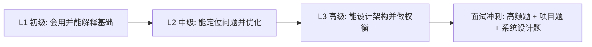

# Java Summary

面向 Java 后端求职的结构化知识库，覆盖 **初级 -> 中级 -> 高级**，目标是做到：
- 路径清晰：知道先学什么、后学什么
- 复习高效：能快速定位高频考点
- 表达可用：可直接用于面试口述

## 从这里开始

1. 先看总入口：[`docs/README.md`](./docs/README.md)
2. 再选一种阅读方式：
   - 按学习顺序：[`docs/01-按学习顺序索引.md`](./docs/01-按学习顺序索引.md)
   - 按面试频率：[`docs/02-按面试频率索引.md`](./docs/02-按面试频率索引.md)
   - 按知识专题：[`docs/03-按专题索引.md`](./docs/03-按专题索引.md)
3. 查看大纲基线：[`docs/10-Java后端-知识大纲-v1.md`](./docs/10-Java后端-知识大纲-v1.md)

## 学习路线图

## 目录结构

- 总索引：[`docs/README.md`](./docs/README.md)
- 学习路线：[`docs/00-总览-学习路线.md`](./docs/00-总览-学习路线.md)
- 调研提炼：[`docs/11-GitHub调研提炼-2026-03-05.md`](./docs/11-GitHub调研提炼-2026-03-05.md)
- 分层索引：
  - [`docs/L1-初级/README.md`](./docs/L1-初级/README.md)
  - [`docs/L2-中级/README.md`](./docs/L2-中级/README.md)
  - [`docs/L3-高级/README.md`](./docs/L3-高级/README.md)
- 示例代码：[`examples/README.md`](./examples/README.md)
- 规则约定：[`AGENTS.md`](./AGENTS.md)

## 阅读建议

- 每次学习一个主题，遵循「结论 -> 原理 -> 场景 -> 问答 -> 代码」。
- 每周至少完成：
  - 3 个能完整解释原理的知识点
  - 10 道可口述的面试题
  - 2 个可运行示例

## 状态说明

- `TODO`：已规划，待编写
- `DOING`：编写中
- `DONE`：已完成并可复习

## 当前进度

- L1：4 个核心模块已完成
- L2：4 个核心模块已完成
- L3：4 个核心模块已完成
- 可运行示例代码：`examples/`（含 L1/L2/L3）
