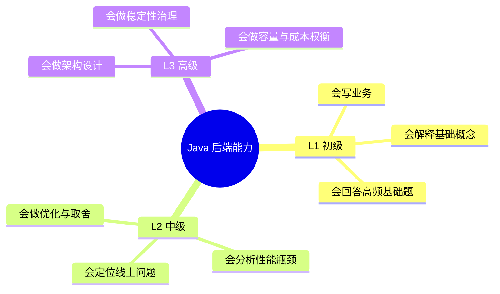

# 总览：学习路线

这份文档用来回答三个问题：
- 我现在在哪个阶段？
- 下一步应该学什么？
- 怎么把知识转化为工程输出与表达能力？

## 先看导航

- 文档总索引：[`README.md`](./README.md)
- 按学习顺序：[`01-按学习顺序索引.md`](./01-按学习顺序索引.md)
- 按面试频率：[`02-按面试频率索引.md`](./02-按面试频率索引.md)
- 按知识专题：[`03-按专题索引.md`](./03-按专题索引.md)
- 练习标准答案：[`19-练习任务标准答案示例-L1-L3.md`](./19-练习任务标准答案示例-L1-L3.md)
- 跨章节串联地图：[`20-跨章节串联学习地图-L1-L2-L3.md`](./20-跨章节串联学习地图-L1-L2-L3.md)
- 压测容量模板：[`21-压测容量与回归阈值模板.md`](./21-压测容量与回归阈值模板.md)

## 三层能力模型

## 推荐节奏（6 周）

| 周次 | 学习重点 | 目标 |
|---|---|---|
| 第 1-2 周 | L1 基础夯实 | 建立完整基础框架，能清楚讲基础原理 |
| 第 3-4 周 | L2 工程与性能 | 能说清典型问题排查与优化路径 |
| 第 5 周 | L3 架构与治理 | 能做系统设计与关键技术取舍 |
| 第 6 周 | 综合实战 | 高频题复盘 + 项目表达 + 模拟面试 |

## 输出标准（每周）

- 至少 3 个“原理可口述”知识点。
- 至少 10 道“有标准答法”面试题。
- 至少 2 个“可运行”代码示例。
- 至少 1 张“可解释系统流程”的图。
