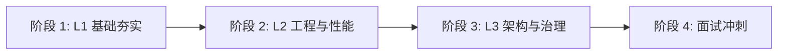

# 按学习顺序索引

> 目标：从“能写业务”到“能讲原理”再到“能做架构权衡”。

## 推荐顺序

## 阶段 1：L1 初级（建议 2 周）

入口：[`L1-初级/README.md`](./L1-初级/README.md)

| 学习顺序 | 模块 | 目标输出 | 状态 |
|---|---|---|---|
| 1 | Java 语法与面向对象 | 能解释封装/继承/多态 + 代码示例 | TODO |
| 2 | 集合框架 | 说清 List/Map 选型与复杂度 | TODO |
| 3 | 并发基础 | 说清线程、锁、线程池基本用法 | TODO |
| 4 | JVM 入门 | 说清内存区域与类加载过程 | TODO |
| 5 | Spring Boot 基础 | 能独立写 CRUD + 参数校验 | TODO |
| 6 | MySQL 基础 | 说清索引、事务、隔离级别 | TODO |
| 7 | Redis 基础 | 说清常用数据结构与使用场景 | TODO |

## 阶段 2：L2 中级（建议 2 周）

入口：[`L2-中级/README.md`](./L2-中级/README.md)

| 学习顺序 | 模块 | 目标输出 | 状态 |
|---|---|---|---|
| 1 | 并发进阶 | 能解释 CAS/AQS、线程池参数策略 | TODO |
| 2 | JVM 调优与排障 | 能给出 OOM/Full GC 排查流程 | TODO |
| 3 | Spring 核心原理 | 能解释 IOC/AOP/事务实现思路 | TODO |
| 4 | MySQL 优化 | 能读执行计划并优化慢 SQL | TODO |
| 5 | 缓存一致性 | 说清穿透/击穿/雪崩治理策略 | TODO |
| 6 | MQ 可靠性 | 说清丢失/重复/顺序处理方案 | TODO |
| 7 | 微服务治理 | 说清限流/熔断/降级基本设计 | TODO |

## 阶段 3：L3 高级（建议 2 周）

入口：[`L3-高级/README.md`](./L3-高级/README.md)

| 学习顺序 | 模块 | 目标输出 | 状态 |
|---|---|---|---|
| 1 | 高并发架构设计 | 能画出高并发系统核心链路 | TODO |
| 2 | 分布式一致性 | 能比较常见一致性方案取舍 | TODO |
| 3 | 高可用治理 | 能说明限流/熔断/降级落地方式 | TODO |
| 4 | 可观测性体系 | 能设计日志/指标/链路体系 | TODO |
| 5 | 容量评估与压测 | 能给出容量估算与压测方案 | TODO |
| 6 | 发布与应急 | 能说明灰度、回滚、故障演练流程 | TODO |

## 阶段 4：面试冲刺（建议 1~2 周）

- 高频题冲刺：[`02-按面试频率索引.md`](./02-按面试频率索引.md)
- 专题查漏补缺：[`03-按专题索引.md`](./03-按专题索引.md)

## 使用方法

- **首次系统学习**：严格按顺序推进。
- **面试前冲刺**：先刷 P0/P1 高频，再回看薄弱模块。
