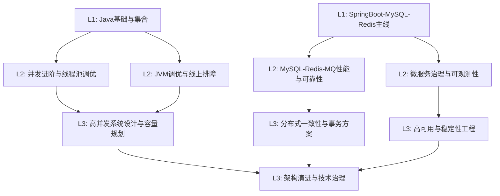

# 跨章节串联学习地图（L1 -> L2 -> L3）

> 目的：把“分散知识点”串成“能力链路”，帮助 0 基础学习者理解为什么要按顺序学。

## 串联思路

- **L1 回答“是什么”**：建立概念和基本用法。
- **L2 回答“怎么排障和优化”**：建立工程视角。
- **L3 回答“怎么做架构权衡”**：建立系统性决策能力。

## 全局能力图



## 主题串联清单（可直接跳转）

| 能力主线 | L1 起点 | L2 进阶 | L3 高阶 | 最终输出 |
|---|---|---|---|---|
| 并发与吞吐 | [`L1-02`](./基础/L1-初级/02-并发与JVM入门.md) | [`L2-01`](./进阶/L2-中级/01-并发进阶与线程池调优.md) | [`L3-01`](./进阶/L3-高级/01-高并发系统设计与容量规划.md) | 线程池调优 + 容量估算说明书 |
| JVM 与稳定性 | [`L1-02`](./基础/L1-初级/02-并发与JVM入门.md) | [`L2-02`](./进阶/L2-中级/02-JVM调优与线上排障.md) | [`L3-03`](./进阶/L3-高级/03-高可用与稳定性工程.md) | OOM 排障闭环 + SLO 指标看板 |
| 数据层性能 | [`L1-03`](./基础/L1-初级/03-SpringBoot-MySQL-Redis开发主线.md) | [`L2-03`](./进阶/L2-中级/03-MySQL-Redis-MQ性能与可靠性.md) | [`L3-02`](./进阶/L3-高级/02-分布式一致性与事务方案.md) | 缓存一致性方案 + 事务选型说明 |
| 微服务治理 | [`L1-03`](./基础/L1-初级/03-SpringBoot-MySQL-Redis开发主线.md) | [`L2-04`](./进阶/L2-中级/04-微服务治理与可观测性.md) | [`L3-04`](./进阶/L3-高级/04-架构演进与技术治理面试.md) | 治理规则 + 架构决策模板 |

## 学习节奏建议（按周）

| 周次 | 主线任务 | 输出物 |
|---|---|---|
| 第 1 周 | L1 并发 + 集合 | 基础概念卡片（20 条） |
| 第 2 周 | L1 SpringBoot + MySQL/Redis | 一个完整 CRUD + 缓存读写流程图 |
| 第 3 周 | L2 并发调优 + JVM 排障 | 线程池参数调优记录 + OOM 定位报告 |
| 第 4 周 | L2 数据与微服务治理 | 慢 SQL 优化前后对比 + 链路观测图 |
| 第 5 周 | L3 高并发与分布式事务 | 容量估算表 + 一致性方案对比文档 |
| 第 6 周 | L3 稳定性与架构治理 | 故障演练复盘 + ADR 决策记录 |

## 章节联动练习（建议每周至少 2 题）

1. 以“秒杀下单”为场景，串联并发控制、缓存、MQ、最终一致性。
2. 以“支付回调”为场景，串联幂等、防重、补偿、告警。
3. 以“突发流量”为场景，串联限流、熔断、降级、容量扩展。

## Java 进度跟踪器（含注释，可直接运行）

**建议文件名：** `Main.java`  
**运行命令：** `javac Main.java && java Main`

```java
import java.util.LinkedHashMap;
import java.util.Map;

public class Main {
    public static void main(String[] args) {
        // 模拟每条主线完成进度（百分比）
        Map<String, Integer> progress = new LinkedHashMap<>();
        progress.put("并发与吞吐", 70);
        progress.put("JVM与稳定性", 55);
        progress.put("数据层性能", 60);
        progress.put("微服务治理", 45);

        for (Map.Entry<String, Integer> entry : progress.entrySet()) {
            String status = entry.getValue() >= 60 ? "达标" : "待加强";
            System.out.println(entry.getKey() + " -> " + entry.getValue() + "% (" + status + ")");
        }
    }
}
```

**预期输出示例：**

```text
并发与吞吐 -> 70% (达标)
JVM与稳定性 -> 55% (待加强)
数据层性能 -> 60% (达标)
微服务治理 -> 45% (待加强)
```
