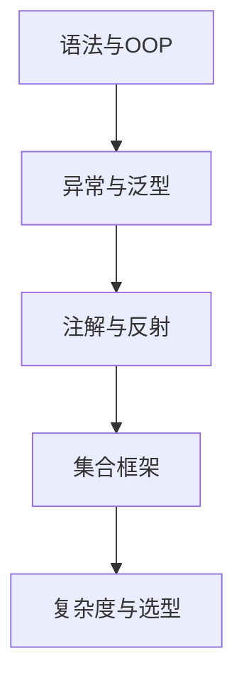

# L1-01 Java 基础与集合

## 这是什么

这一章聚焦 Java 初学和面试最常问的基础能力：
- 语法与 OOP（封装/继承/多态）
- 异常、泛型、注解、反射
- 集合框架（List/Map/Set）与复杂度

## 为什么重要

- L1 面试中，基础题占比高且容易追问。
- 基础不稳会直接影响并发、Spring、JVM 的理解深度。

## 知识结构图

## 关键知识点

### 1) 值传递（必会）

一句话：**Java 只有值传递**，对象参数传的是“引用的副本”。

- 你可以通过引用副本修改对象内部状态。
- 你不能通过修改引用副本本身来改变外部引用指向。

示例：[`../../examples/l1/ValuePassingDemo.java`](../../examples/l1/ValuePassingDemo.java)

### 2) 集合选型（必会）

| 场景 | 推荐 | 理由 |
|---|---|---|
| 随机访问多 | `ArrayList` | 连续内存，按下标读取快 |
| 插入删除频繁（中间位置） | `LinkedList`（谨慎） | 链表理论优势，但缓存局部性较差 |
| 键值查询 | `HashMap` | 平均 O(1) |
| 有序键值 | `TreeMap` | 红黑树，支持范围查询 |
| 去重 | `HashSet` | 基于哈希结构 |

### 3) HashMap 高频点（必会）

- JDK8 后结构：数组 + 链表 + 红黑树。
- 扩容时机会影响性能，容量建议按预估规模初始化。
- 线程不安全，多线程场景用 `ConcurrentHashMap`。

## 常见误区

- 误区 1：`LinkedList` 一定比 `ArrayList` 插入快。  
  实际：多数业务场景下 `ArrayList` 常更快（CPU 缓存友好）。
- 误区 2：会背 API 就算掌握集合。  
  实际：面试更看重“如何选型 + 为何这样选”。

## 高频面试题（含答题骨架）

### Q1：Java 为什么只有值传递？

答题骨架：
1. 语言层定义：参数传递是值拷贝。
2. 基本类型：拷贝字面值。
3. 引用类型：拷贝引用地址值。
4. 结论：可改对象状态，不可改外部引用指向。

### Q2：`ArrayList` 和 `LinkedList` 怎么选？

答题骨架：
1. 明确业务操作比例（读多/写多）。
2. 说明时间复杂度与 CPU 缓存影响。
3. 给出最终选型与边界条件。

## 延伸阅读

- [JavaGuide - Java 基础](https://github.com/Snailclimb/JavaGuide/tree/main/docs/java)
- [toBeBetterJavaer - 基础语法](https://github.com/itwanger/toBeBetterJavaer)
