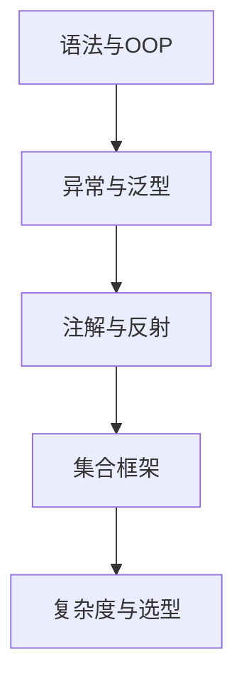

# L1-01 Java 基础与集合

## 这是什么

这一章聚焦 Java 初学和面试最常问的基础能力：
- 语法与 OOP（封装/继承/多态）
- 异常、泛型、注解、反射
- 集合框架（List/Map/Set）与复杂度

## 为什么重要

- L1 面试中，基础题占比高且容易追问。
- 基础不稳会直接影响并发、Spring、JVM 的理解深度。

## 知识结构图



## 关键知识点

### 1) 值传递（必会）

一句话：**Java 只有值传递**，对象参数传的是“引用的副本”。

- 你可以通过引用副本修改对象内部状态。
- 你不能通过修改引用副本本身来改变外部引用指向。

示例：[`../../examples/l1/ValuePassingDemo.java`](../../examples/l1/ValuePassingDemo.java)

### 2) 集合选型（必会）

| 场景 | 推荐 | 理由 |
|---|---|---|
| 随机访问多 | `ArrayList` | 连续内存，按下标读取快 |
| 插入删除频繁（中间位置） | `LinkedList`（谨慎） | 链表理论优势，但缓存局部性较差 |
| 键值查询 | `HashMap` | 平均 O(1) |
| 有序键值 | `TreeMap` | 红黑树，支持范围查询 |
| 去重 | `HashSet` | 基于哈希结构 |

### 3) HashMap 高频点（必会）

- JDK8 后结构：数组 + 链表 + 红黑树。
- 扩容时机会影响性能，容量建议按预估规模初始化。
- 线程不安全，多线程场景用 `ConcurrentHashMap`。

## 常见误区

- 误区 1：`LinkedList` 一定比 `ArrayList` 插入快。  
  实际：多数业务场景下 `ArrayList` 常更快（CPU 缓存友好）。
- 误区 2：会背 API 就算掌握集合。  
  实际：面试更看重“如何选型 + 为何这样选”。

## 高频面试题（含答题骨架）

### Q1：Java 为什么只有值传递？

答题骨架：
1. 语言层定义：参数传递是值拷贝。
2. 基本类型：拷贝字面值。
3. 引用类型：拷贝引用地址值。
4. 结论：可改对象状态，不可改外部引用指向。

### Q2：`ArrayList` 和 `LinkedList` 怎么选？

答题骨架：
1. 明确业务操作比例（读多/写多）。
2. 说明时间复杂度与 CPU 缓存影响。
3. 给出最终选型与边界条件。

## 延伸阅读

- [JavaGuide - Java 基础](https://github.com/Snailclimb/JavaGuide/tree/main/docs/java)
- [toBeBetterJavaer - 基础语法](https://github.com/itwanger/toBeBetterJavaer)

## 深入子章节

- [`11-L1-M1-S01-数据类型与包装类.md`](./11-L1-M1-S01-数据类型与包装类.md)
- [`12-L1-M1-S02-String与BigDecimal常见坑.md`](./12-L1-M1-S02-String与BigDecimal常见坑.md)
- [`13-L1-M1-S03-OOP与接口设计基础.md`](./13-L1-M1-S03-OOP与接口设计基础.md)
- [`14-L1-M1-S04-异常体系与实践.md`](./14-L1-M1-S04-异常体系与实践.md)
- [`15-L1-M1-S05-泛型与通配符.md`](./15-L1-M1-S05-泛型与通配符.md)
- [`16-L1-M1-S06-集合选型与复杂度.md`](./16-L1-M1-S06-集合选型与复杂度.md)


## 前置知识

- 知道 List/Set/Map 基本用途。
- 理解查询、插入、删除三类操作。

## 术语解释（零基础友好）

- **选型**：根据场景选择最合适数据结构。
- **复杂度**：操作耗时随规模增长趋势。

## 详细学习步骤（从不会到会）

1. 先明确场景约束（读写比/有序/去重）。
2. 初选集合并验证功能正确。
3. 压测关键路径再定型。

## 常见错误与纠偏

- 只背复杂度不看实际访问模式。
- 并发场景忽略线程安全。

## 学习动作

- 先手敲一次示例代码，确保可以独立运行。
- 用自己的话复述“定义 -> 原理 -> 场景 -> 边界”。
- 把本节关键结论写成 3 句速记卡，第二天复盘。

## 练习任务（建议动手）

1. 给三个场景写集合选型说明。
2. 对比两种集合在关键操作下的表现。

## 练习参考方向

- 选型要“场景驱动+数据验证”。

## 复习检查

- [ ] 能在 90 秒内说明本节核心结论
- [ ] 能独立运行并解释示例代码输出
- [ ] 能说出至少 1 个常见错误与修正方式


## 错答示例 -> 修正答法 -> 打分差异（章级题解）

### 练习题目（围绕本章：Java基础与集合）

- 请用 90 秒说明“定义 -> 原理 -> 场景 -> 风险 -> 验证”完整答题链路。
- 请补充至少 1 个线上或项目中的落地例子，并说明为什么这样做。

### 常见错答示例（低分版）

- 只说概念，不说机制：例如只背定义，无法解释底层流程。
- 只说优点，不说边界：没有说明适用条件与失败场景。
- 没有指标验证：讲完方案后不给量化结果或回归口径。

### 修正答法（高分版）

1. 先给结论：一句话说清本章知识点解决什么问题。
2. 再讲原理：用 2~3 个关键机制串起完整流程。
3. 再落场景：给出一个可复现的业务场景和方案选择理由。
4. 再说风险：列出至少 2 个常见坑和对应防护动作。
5. 最后验证：给出可观测指标（如延迟、错误率、吞吐、资源占用）与目标阈值。

### 打分差异示例（同题对比）

| 评分维度 | 错答（低分） | 修正（高分） | 提升点 |
|---|---|---|---|
| 概念准确 | 只背术语 | 术语 + 边界条件 | 避免概念混淆 |
| 原理完整 | 断点式描述 | 链路化描述 | 解释能力更强 |
| 场景匹配 | 空泛举例 | 贴近业务约束 | 方案更可信 |
| 风险意识 | 不提失败 | 提供兜底与回滚 | 工程可落地 |
| 验证闭环 | 无量化指标 | 指标 + 阈值 + 回归 | 可复盘可验收 |

### 自测动作

- 录音 90 秒复述本章答案，回听是否覆盖五段结构。
- 对照本章“复习检查”逐条打分，低于 80 分重答。
- 把本章答案压缩成 5 句话，训练高压场景下的表达稳定性。

## Java 示例代码（含注释，可直接运行）


**建议文件名：** `Main.java`  
**运行命令：** `javac Main.java && java Main`

**预期输出（示例）：**
```text
list0=A
mapK=1
```

```java
import java.util.ArrayList;
import java.util.HashMap;
import java.util.List;
import java.util.Map;

public class Main {
    public static void main(String[] args) {
        // 读多写少：ArrayList 是常见起点
        List<String> list = new ArrayList<>();
        list.add("A");

        // 键值映射默认优先 HashMap
        Map<String, Integer> map = new HashMap<>();
        map.put("k", 1);

        System.out.println("list0=" + list.get(0));
        System.out.println("mapK=" + map.get("k"));
    }
}
```
