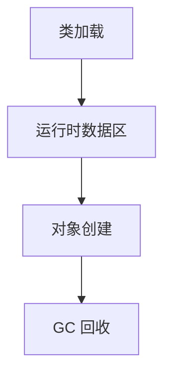

# L1-02 并发与 JVM 入门

## 这是什么

本章解决两个核心问题：
- Java 代码在多线程下如何保证正确性。
- Java 程序在 JVM 里如何运行和回收内存。

## 并发基础图


## JVM 入门图



## 关键知识点

### 1) `synchronized` 与 `volatile`

- `synchronized`：互斥 + 可见性 + 有序性。
- `volatile`：保证可见性和有序性，不保证复合操作原子性。

### 2) 线程池

面试高频参数：
- `corePoolSize`
- `maximumPoolSize`
- `workQueue`
- `RejectedExecutionHandler`

示例：[`../../examples/basic/ThreadPoolQuickDemo.java`](../../examples/basic/ThreadPoolQuickDemo.java)

### 3) JVM 运行时数据区（必会）

- 堆：对象实例
- 栈：方法栈帧
- 方法区（元空间）：类元数据
- 程序计数器、本地方法栈

## 常见误区

- 误区 1：`volatile` 能替代锁。  
  实际：仅对单次读写有效，`i++` 仍可能竞态。
- 误区 2：线程越多吞吐越高。  
  实际：过多线程会带来上下文切换和争用开销。

## 高频面试题

### Q1：`volatile` 解决了什么问题？

答题骨架：
1. 解决可见性：线程能看到最新值。
2. 通过内存屏障限制指令重排序。
3. 不保证原子性，复合操作仍需锁或原子类。

### Q2：JVM 内存区域有哪些？

答题骨架：
1. 先按线程私有/共享划分。
2. 再逐个说明存放内容。
3. 最后补充常见错误（如堆 OOM、栈溢出）。

## 延伸阅读

- [JavaGuide - JVM](https://github.com/Snailclimb/JavaGuide/tree/main/docs/java/jvm)
- [advanced-java - 高并发](https://github.com/doocs/advanced-java/tree/main/docs/high-concurrency)


## 前置知识

- 知道线程可并行执行任务。
- 会写最小可运行程序。

## 术语解释（零基础友好）

- **并发**：同一时段处理多个任务。
- **同步**：控制多线程访问顺序与一致性。

## 详细学习步骤（从不会到会）

1. 先运行最小并发示例。
2. 加入同步控制验证正确性。
3. 观察日志定位时序问题。

## 常见错误与纠偏

- 只看结果不看线程时序。
- 没有退出条件导致线程泄漏。

## 学习动作

- 先手敲一次示例代码，确保可以独立运行。
- 用自己的话复述“定义 -> 原理 -> 场景 -> 边界”。
- 把本节关键结论写成 3 句速记卡，第二天复盘。

## 练习任务（建议动手）

1. 实现主子线程协作示例。
2. 模拟竞态并给修复方案。

## 练习参考方向

- 并发问题先复现，再定位，再修复。

## 复习检查

- [ ] 能在 90 秒内说明本节核心结论
- [ ] 能独立运行并解释示例代码输出
- [ ] 能说出至少 1 个常见错误与修正方式


## 错答示例 -> 修正答法 -> 打分差异（章级题解）

### 练习题目（围绕本章：并发与JVM入门）

- 请用 90 秒说明“定义 -> 原理 -> 场景 -> 风险 -> 验证”完整答题链路。
- 请补充至少 1 个线上或项目中的落地例子，并说明为什么这样做。

### 常见错答示例（低分版）

- 只说概念，不说机制：例如只背定义，无法解释底层流程。
- 只说优点，不说边界：没有说明适用条件与失败场景。
- 没有指标验证：讲完方案后不给量化结果或回归口径。

### 修正答法（高分版）

1. 先给结论：一句话说清本章知识点解决什么问题。
2. 再讲原理：用 2~3 个关键机制串起完整流程。
3. 再落场景：给出一个可复现的业务场景和方案选择理由。
4. 再说风险：列出至少 2 个常见坑和对应防护动作。
5. 最后验证：给出可观测指标（如延迟、错误率、吞吐、资源占用）与目标阈值。

### 打分差异示例（同题对比）

| 评分维度 | 错答（低分） | 修正（高分） | 提升点 |
|---|---|---|---|
| 概念准确 | 只背术语 | 术语 + 边界条件 | 避免概念混淆 |
| 原理完整 | 断点式描述 | 链路化描述 | 解释能力更强 |
| 场景匹配 | 空泛举例 | 贴近业务约束 | 方案更可信 |
| 风险意识 | 不提失败 | 提供兜底与回滚 | 工程可落地 |
| 验证闭环 | 无量化指标 | 指标 + 阈值 + 回归 | 可复盘可验收 |

### 自测动作

- 录音 90 秒复述本章答案，回听是否覆盖五段结构。
- 对照本章“复习检查”逐条打分，低于 80 分重答。
- 把本章答案压缩成 5 句话，训练高压场景下的表达稳定性。

## Java 示例代码（含注释，可直接运行）


**建议文件名：** `Main.java`  
**运行命令：** `javac Main.java && java Main`

**预期输出（示例）：**
```text
worker running
main done
```

```java
public class Main {
    public static void main(String[] args) throws InterruptedException {
        Thread worker = new Thread(() -> {
            // 子线程执行任务
            System.out.println("worker running");
        });

        worker.start();
        // join 确保主线程等待子线程结束
        worker.join();
        System.out.println("main done");
    }
}
```
