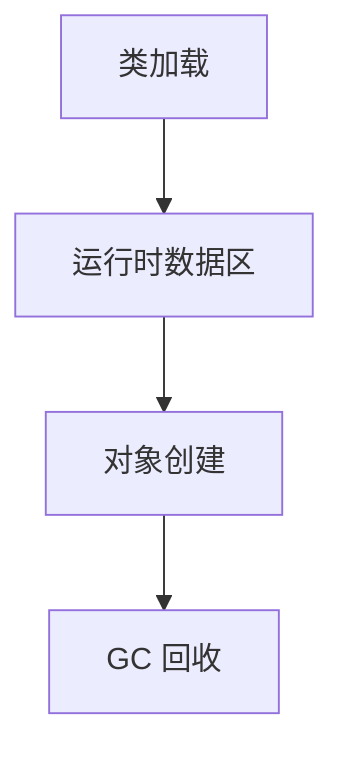

# L1-02 并发与 JVM 入门

## 这是什么

本章解决两个核心问题：
- Java 代码在多线程下如何保证正确性。
- Java 程序在 JVM 里如何运行和回收内存。

## 并发基础图


## JVM 入门图



## 关键知识点

### 1) `synchronized` 与 `volatile`

- `synchronized`：互斥 + 可见性 + 有序性。
- `volatile`：保证可见性和有序性，不保证复合操作原子性。

### 2) 线程池

面试高频参数：
- `corePoolSize`
- `maximumPoolSize`
- `workQueue`
- `RejectedExecutionHandler`

示例：[`../../examples/basic/ThreadPoolQuickDemo.java`](../../examples/basic/ThreadPoolQuickDemo.java)

### 3) JVM 运行时数据区（必会）

- 堆：对象实例
- 栈：方法栈帧
- 方法区（元空间）：类元数据
- 程序计数器、本地方法栈

## 常见误区

- 误区 1：`volatile` 能替代锁。  
  实际：仅对单次读写有效，`i++` 仍可能竞态。
- 误区 2：线程越多吞吐越高。  
  实际：过多线程会带来上下文切换和争用开销。

## 高频面试题

### Q1：`volatile` 解决了什么问题？

答题骨架：
1. 解决可见性：线程能看到最新值。
2. 通过内存屏障限制指令重排序。
3. 不保证原子性，复合操作仍需锁或原子类。

### Q2：JVM 内存区域有哪些？

答题骨架：
1. 先按线程私有/共享划分。
2. 再逐个说明存放内容。
3. 最后补充常见错误（如堆 OOM、栈溢出）。

## 延伸阅读

- [JavaGuide - JVM](https://github.com/Snailclimb/JavaGuide/tree/main/docs/java/jvm)
- [advanced-java - 高并发](https://github.com/doocs/advanced-java/tree/main/docs/high-concurrency)

## Java 示例代码（含注释，可直接运行）

**建议文件名：** `Main.java`  
**运行命令：** `javac Main.java && java Main`

**预期输出（示例）：**
```text
worker running
main done
```

```java
public class Main {
    public static void main(String[] args) throws InterruptedException {
        Thread worker = new Thread(() -> {
            // 子线程执行任务
            System.out.println("worker running");
        });

        worker.start();
        // join 确保主线程等待子线程结束
        worker.join();
        System.out.println("main done");
    }
}
```
