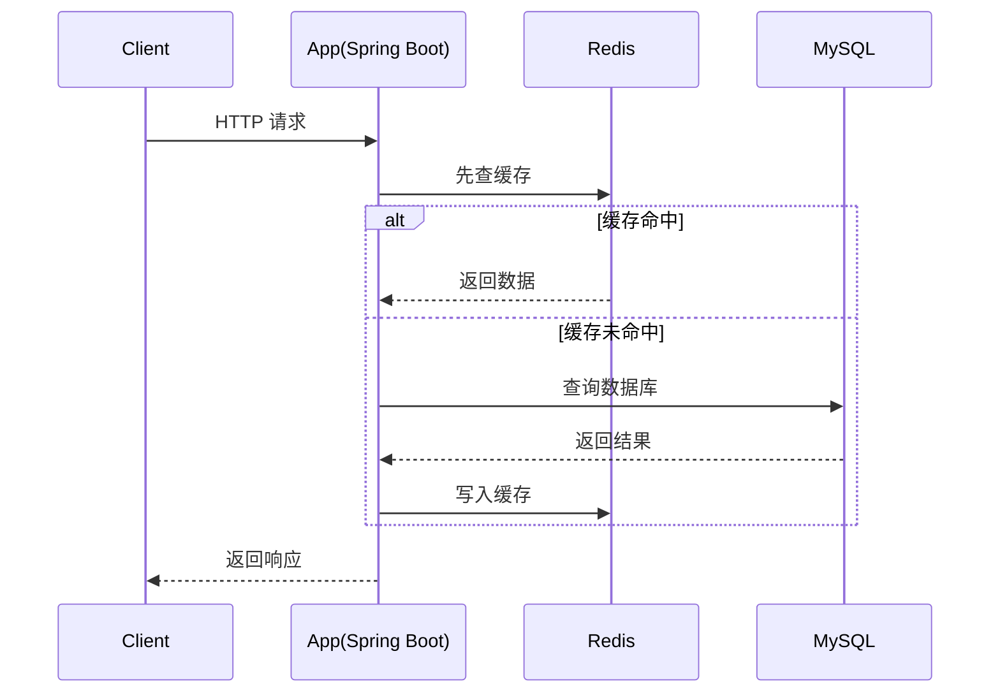

# L1-03 Spring Boot + MySQL + Redis 开发主线

## 这是什么

这章把“后端日常开发主链路”串起来：
- Web 接口开发（Spring Boot）
- 持久化（MySQL）
- 缓存提速（Redis）

## 主链路流程图



## 关键知识点

### 1) Spring Boot 基础

- 分层结构：Controller / Service / Repository
- 参数校验：`@Valid`
- 异常处理：`@RestControllerAdvice`

### 2) MySQL 基础

- 索引本质：减少扫描行数
- 事务 ACID 与隔离级别
- `EXPLAIN` 看执行计划

### 3) Redis 基础

- 常用结构：String、Hash、List、Set、ZSet
- 典型模式：Cache Aside（旁路缓存）

示例：[`../../examples/l2/CacheAsideDemo.java`](../../examples/l2/CacheAsideDemo.java)

## 常见误区

- 误区 1：有索引就一定快。  
  实际：回表、低选择性、函数操作列都可能导致慢查询。
- 误区 2：缓存更新必须“先删缓存再更数据库”。  
  实际：更常见推荐是“先更新数据库再删缓存”。

## 高频面试题

### Q1：为什么要用 Redis 缓存？

答题骨架：
1. 目标：降低数据库压力、缩短响应时间。
2. 手段：热点数据缓存、减少重复查询。
3. 风险：一致性问题、缓存穿透/击穿/雪崩。
4. 方案：限流、布隆过滤、互斥重建、多级缓存。

### Q2：事务隔离级别怎么选？

答题骨架：
1. 先说四个隔离级别。
2. 明确默认级别（MySQL InnoDB：`REPEATABLE READ`）。
3. 按业务一致性要求与性能成本权衡。

## 延伸阅读

- [JavaGuide - 数据库](https://github.com/Snailclimb/JavaGuide/tree/main/docs/database)
- [JavaGuide - Redis](https://github.com/Snailclimb/JavaGuide/tree/main/docs/database/redis)

## Java 示例代码（含注释）

```java
class UserController {
    private final UserService userService = new UserService();

    String getUser(Long id) {
        // Controller 负责请求入口与参数边界
        return userService.findNameById(id);
    }
}

class UserService {
    String findNameById(Long id) {
        // Service 承载业务编排与规则
        return "user-" + id;
    }
}
```

