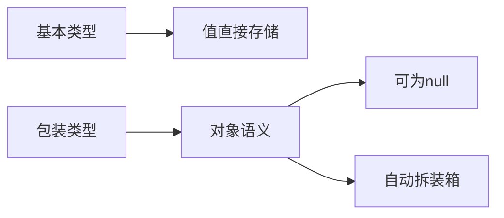

# L1-M1-S01 数据类型与包装类

## 一句话结论

- 基本类型存值，包装类型是对象；两者在性能、判空、比较语义上有明显差异。

## 知识图



## 核心知识点

### 1) 基本类型与包装类型

- 基本类型：`byte/short/int/long/float/double/char/boolean`
- 包装类型：`Byte/Short/Integer/Long/Float/Double/Character/Boolean`

常见选择：
- 计算密集、循环内热点变量优先基本类型。
- 需要 `null`、泛型、集合存储时使用包装类型。

### 2) 自动拆装箱的坑

- `Integer x = null; int y = x;` 会触发 `NullPointerException`。
- `Integer a = 127; Integer b = 127;` 可能 `a == b` 为 `true`（缓存）。
- `Integer a = 128; Integer b = 128;` 可能 `a == b` 为 `false`。

### 3) 比较规则

- 对象内容比较用 `equals`。
- 基本类型比较用 `==`。
- 包装类型比较不要依赖 `==`。

## 示例代码

- [`../../examples/l1/DataTypeAndWrapperDemo.java`](../../examples/l1/DataTypeAndWrapperDemo.java)

## 高频面试题

### Q1：`Integer` 和 `int` 有什么区别？

答题骨架：
1. 存储语义不同（值 vs 对象）。
2. 是否允许 `null` 不同。
3. 使用场景不同（泛型和集合必须对象）。
4. 性能与拆装箱开销需要考虑。

### Q2：为什么有时 `Integer` 用 `==` 结果“看起来正确”？

答题骨架：
1. JVM 有 Integer 缓存（常见区间 `-128~127`）。
2. 缓存命中时比较的是同一对象引用。
3. 超出缓存区间后行为不同，不能依赖。

## 复习检查

- [ ] 能解释拆装箱触发时机
- [ ] 能说出 `==` 与 `equals` 语义区别
- [ ] 能举出至少一个线上 NPE 场景

## Java 示例代码（含注释）

```java
public class DataTypeSnippet {
    public static void main(String[] args) {
        // 基本类型直接存值，性能更稳定
        int a = 10;
        // 包装类型可用于集合与泛型
        Integer b = a;
        // 比较包装类型内容时优先使用 equals
        System.out.println("sameValue=" + b.equals(10));
    }
}
```

