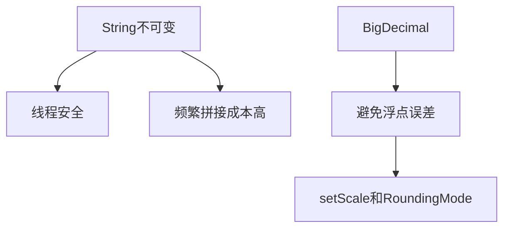

# L1-M1-S02 String 与 BigDecimal 常见坑

## 一句话结论

- 字符串处理要注意不可变特性和拼接成本；金额计算必须用 `BigDecimal` 并显式指定舍入规则。

## 知识图



## 核心知识点

### 1) String 不可变

- `String` 是不可变对象，修改会创建新对象。
- 频繁拼接优先 `StringBuilder`。
- 比较内容用 `equals`，不要混用 `==`。

### 2) 金额计算

- `double` 适合科学计算，不适合金额。
- `BigDecimal` 创建建议用字符串：`new BigDecimal("0.1")`。
- 除法要指定舍入模式，否则可能抛 `ArithmeticException`。

### 3) 常见坑

- `new BigDecimal(0.1)` 会引入二进制浮点误差。
- `setScale` 未指定舍入规则在某些场景不可控。

## 示例代码

- [`../../examples/l1/StringBigDecimalPitfallsDemo.java`](../../examples/l1/StringBigDecimalPitfallsDemo.java)

## 高频面试题

### Q1：为什么说 String 是不可变的？

答题骨架：
1. 底层字符数组引用不可改（语义上不可变）。
2. 修改操作都会生成新对象。
3. 不可变带来安全性和缓存优化收益。

### Q2：为什么金额用 BigDecimal 而不是 double？

答题骨架：
1. double 二进制表示会带精度误差。
2. BigDecimal 提供十进制精确计算。
3. 金额场景必须可控舍入。

## 复习检查

- [ ] 能举例说明 `new BigDecimal(0.1)` 的问题
- [ ] 能说明 StringBuilder 使用场景
- [ ] 能口述金额计算规范

## Java 示例代码（含注释，可直接运行）

**建议文件名：** `Main.java`  
**运行命令：** `javac Main.java && java Main`

**预期输出（示例）：**
```text
text=java
total=0.60
```

```java
import java.math.BigDecimal;
import java.math.RoundingMode;

public class Main {
    public static void main(String[] args) {
        // StringBuilder 适合频繁拼接
        StringBuilder sb = new StringBuilder();
        sb.append("ja").append("va");

        // 金额场景用字符串构造 BigDecimal，避免浮点误差
        BigDecimal amount = new BigDecimal("10.00");
        BigDecimal ratio = new BigDecimal("0.06");
        BigDecimal total = amount.multiply(ratio).setScale(2, RoundingMode.HALF_UP);

        System.out.println("text=" + sb);
        System.out.println("total=" + total);
    }
}
```
