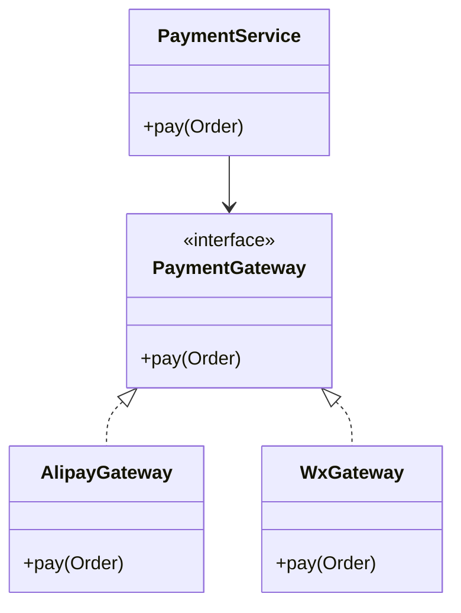

# L1-M1-S03 OOP 与接口设计基础

## 一句话结论

- OOP 重点不是“会写类”，而是通过抽象和边界控制降低耦合、提升可维护性。

## 设计图



## 核心知识点

### 1) 四大特性

- 封装：隐藏实现细节，暴露稳定接口。
- 继承：复用共性能力。
- 多态：面向抽象编程，运行时替换实现。
- 抽象：提炼稳定模型和约束。

### 2) 接口优先

- 依赖接口而不是具体实现，有利于替换和测试。
- 业务层只关注能力，不关心底层支付渠道细节。

### 3) 常见设计错误

- 一个类承担太多职责（违反单一职责）。
- 直接依赖具体实现，导致难扩展。

## 高频面试题

### Q1：接口和抽象类怎么选？

答题骨架：
1. 关注“能力约束”优先接口。
2. 有共享默认实现可考虑抽象类。
3. 结合继承层级复杂度做取舍。

### Q2：多态在项目里有什么价值？

答题骨架：
1. 降低分支判断和耦合。
2. 支持按策略扩展。
3. 提升测试可替换性。

## 复习检查

- [ ] 能给出接口解耦的真实项目例子
- [ ] 能说清接口和抽象类边界
- [ ] 能说明一个错误设计如何重构


## 前置知识

- 理解类、对象、方法的基本概念。
- 会写简单的 `if/else` 业务分支。
- 知道“高内聚、低耦合”的基本目标。

## 术语解释（零基础友好）

- **封装**：把数据与行为放在一起，并限制外部直接访问细节。
- **多态**：同一接口在不同实现下表现不同行为。
- **依赖倒置**：上层依赖抽象而不是具体实现。

## 详细学习步骤（从不会到会）

1. 先写一个只依赖具体类的版本，体验扩展时需要改动的痛点。
2. 引入接口抽象支付能力，把实现放到不同网关类里。
3. 在调用层只依赖接口类型，完成“替换实现不改业务代码”。
4. 最后评估代码可测试性和可维护性是否提升。

## 常见错误与纠偏

- 业务层直接 `new` 多个具体实现，导致耦合度过高。
- 把接口拆得过细，造成调用链复杂且理解成本高。

## 学习动作

- 先手敲一次示例代码，确保可以独立运行。
- 用自己的话复述“定义 -> 原理 -> 场景 -> 边界”。
- 把本节关键结论写成 3 句速记卡，第二天复盘。

## 练习任务（建议动手）

1. 设计一个通知系统接口，分别实现短信和邮件两个实现类。
2. 给支付流程增加“模拟失败实现”，用于本地测试。

## 练习参考方向

- 先抽“稳定能力”再抽接口，避免过度抽象。
- 测试实现可用于验证异常分支和降级逻辑。

## 复习检查

- [ ] 能在 90 秒内说明本节核心结论
- [ ] 能独立运行并解释示例代码输出
- [ ] 能说出至少 1 个常见错误与修正方式

## Java 示例代码（含注释，可直接运行）


**建议文件名：** `Main.java`  
**运行命令：** `javac Main.java && java Main`

**预期输出（示例）：**
```text
paid=true
```

```java
interface PaymentGateway {
    boolean pay(long cents);
}

class MockGateway implements PaymentGateway {
    @Override
    public boolean pay(long cents) {
        // 面向接口编程，便于替换实现
        return cents > 0;
    }
}

public class Main {
    public static void main(String[] args) {
        PaymentGateway gateway = new MockGateway();
        System.out.println("paid=" + gateway.pay(100));
    }
}
```
