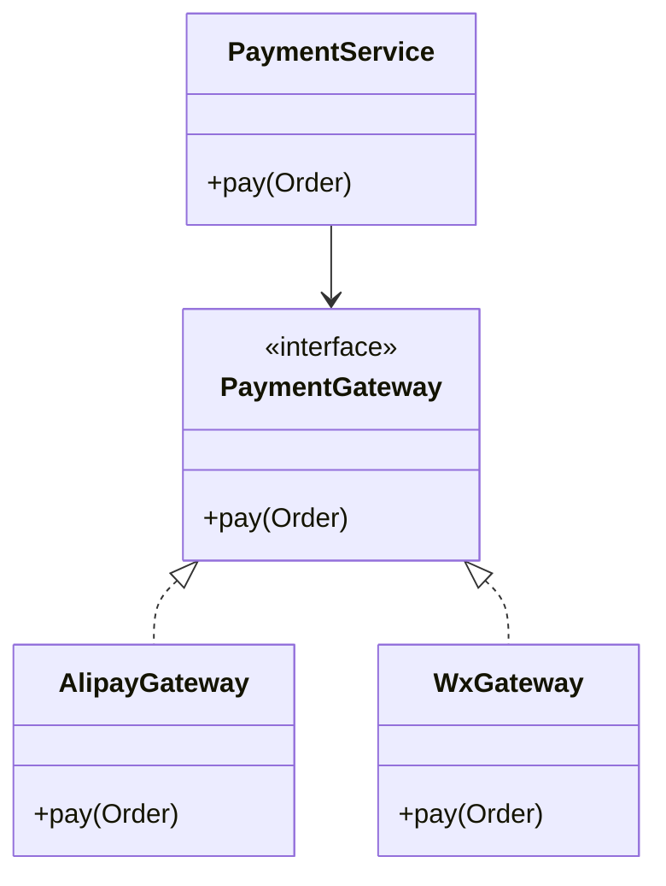

# L1-M1-S03 OOP 与接口设计基础

## 一句话结论

- OOP 重点不是“会写类”，而是通过抽象和边界控制降低耦合、提升可维护性。

## 设计图



## 核心知识点

### 1) 四大特性

- 封装：隐藏实现细节，暴露稳定接口。
- 继承：复用共性能力。
- 多态：面向抽象编程，运行时替换实现。
- 抽象：提炼稳定模型和约束。

### 2) 接口优先

- 依赖接口而不是具体实现，有利于替换和测试。
- 业务层只关注能力，不关心底层支付渠道细节。

### 3) 常见设计错误

- 一个类承担太多职责（违反单一职责）。
- 直接依赖具体实现，导致难扩展。

## 高频面试题

### Q1：接口和抽象类怎么选？

答题骨架：
1. 关注“能力约束”优先接口。
2. 有共享默认实现可考虑抽象类。
3. 结合继承层级复杂度做取舍。

### Q2：多态在项目里有什么价值？

答题骨架：
1. 降低分支判断和耦合。
2. 支持按策略扩展。
3. 提升测试可替换性。

## 复习检查

- [ ] 能给出接口解耦的真实项目例子
- [ ] 能说清接口和抽象类边界
- [ ] 能说明一个错误设计如何重构

## Java 示例代码（含注释，可直接运行）

**建议文件名：** `Main.java`  
**运行命令：** `javac Main.java && java Main`

**预期输出（示例）：**
```text
paid=true
```

```java
interface PaymentGateway {
    boolean pay(long cents);
}

class MockGateway implements PaymentGateway {
    @Override
    public boolean pay(long cents) {
        // 面向接口编程，便于替换实现
        return cents > 0;
    }
}

public class Main {
    public static void main(String[] args) {
        PaymentGateway gateway = new MockGateway();
        System.out.println("paid=" + gateway.pay(100));
    }
}
```
