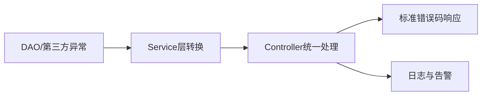

# L1-M1-S04 异常体系与实践

## 一句话结论

- 异常处理核心是“分类、边界、可观测”，不是一味 `try-catch` 吞掉错误。

## 异常流转图

## 核心知识点

### 1) 异常分类

- `Checked Exception`：编译期要求显式处理。
- `RuntimeException`：运行时异常，常用于业务和系统错误。

### 2) 边界处理

- DAO 层：保留底层异常信息。
- Service 层：封装业务语义。
- Controller 层：统一转换为对外错误码。

### 3) 实战原则

- 不要空 `catch`。
- 日志要带上下文（请求ID、关键参数）。
- 只在可恢复场景下重试。

## 示例代码

- [`../../examples/l1/ExceptionPracticeDemo.java`](../../examples/l1/ExceptionPracticeDemo.java)

## 高频面试题

### Q1：`throw` 和 `throws` 区别？

答题骨架：
1. `throw` 用于抛出具体异常对象。
2. `throws` 用于声明方法可能抛出的异常类型。
3. 两者分别作用于方法体与方法签名。

### Q2：线上异常日志应该怎么打？

答题骨架：
1. 记录错误码和异常栈。
2. 带请求上下文（traceId、用户ID、关键入参）。
3. 区分可预期异常与系统异常。

## 复习检查

- [ ] 能说清异常分层处理策略
- [ ] 能写出统一异常返回模型
- [ ] 能说明何时该重试、何时不该重试
