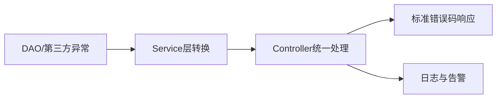

# L1-M1-S04 异常体系与实践

## 一句话结论

- 异常处理核心是“分类、边界、可观测”，不是一味 `try-catch` 吞掉错误。

## 异常流转图



## 核心知识点

### 1) 异常分类

- `Checked Exception`：编译期要求显式处理。
- `RuntimeException`：运行时异常，常用于业务和系统错误。

### 2) 边界处理

- DAO 层：保留底层异常信息。
- Service 层：封装业务语义。
- Controller 层：统一转换为对外错误码。

### 3) 实战原则

- 不要空 `catch`。
- 日志要带上下文（请求ID、关键参数）。
- 只在可恢复场景下重试。

## 示例代码

- [`../../examples/l1/ExceptionPracticeDemo.java`](../../examples/l1/ExceptionPracticeDemo.java)

## 高频面试题

### Q1：`throw` 和 `throws` 区别？

答题骨架：
1. `throw` 用于抛出具体异常对象。
2. `throws` 用于声明方法可能抛出的异常类型。
3. 两者分别作用于方法体与方法签名。

### Q2：线上异常日志应该怎么打？

答题骨架：
1. 记录错误码和异常栈。
2. 带请求上下文（traceId、用户ID、关键入参）。
3. 区分可预期异常与系统异常。

## 复习检查

- [ ] 能说清异常分层处理策略
- [ ] 能写出统一异常返回模型
- [ ] 能说明何时该重试、何时不该重试


## 前置知识

- 知道方法调用与返回。
- 了解 `try/catch` 基本语法。
- 会看控制台异常输出。

## 术语解释（零基础友好）

- **受检异常**：编译器要求显式处理或抛出的异常类型。
- **运行时异常**：运行期间才暴露的异常，常用于业务校验与系统错误。
- **异常边界**：在哪一层捕获、转换和对外暴露错误信息。

## 详细学习步骤（从不会到会）

1. 先定义业务校验异常，明确“输入非法”属于业务错误。
2. 在 service 层抛异常，在 controller 层统一捕获并格式化输出。
3. 日志中打印关键上下文（请求ID、关键参数）便于排查。
4. 为可恢复场景添加有限重试，不可恢复场景快速失败。

## 常见错误与纠偏

- 空 `catch` 吞掉异常，导致线上问题无法回溯。
- 所有异常都返回同一文案，调用方无法区分错误类型。

## 学习动作

- 先手敲一次示例代码，确保可以独立运行。
- 用自己的话复述“定义 -> 原理 -> 场景 -> 边界”。
- 把本节关键结论写成 3 句速记卡，第二天复盘。

## 练习任务（建议动手）

1. 实现一个下单方法，对数量和库存做异常校验。
2. 设计统一错误响应对象，包含 code/message。

## 练习参考方向

- 异常响应要区分业务错误与系统错误。
- 重试必须有次数上限和超时保护。

## 复习检查

- [ ] 能在 90 秒内说明本节核心结论
- [ ] 能独立运行并解释示例代码输出
- [ ] 能说出至少 1 个常见错误与修正方式


## 错答示例 -> 修正答法 -> 打分差异（章级题解）

### 练习题目（围绕本章：异常体系与实践）

- 请用 90 秒说明“定义 -> 原理 -> 场景 -> 风险 -> 验证”完整答题链路。
- 请补充至少 1 个线上或项目中的落地例子，并说明为什么这样做。

### 常见错答示例（低分版）

- 只说概念，不说机制：例如只背定义，无法解释底层流程。
- 只说优点，不说边界：没有说明适用条件与失败场景。
- 没有指标验证：讲完方案后不给量化结果或回归口径。

### 修正答法（高分版）

1. 先给结论：一句话说清本章知识点解决什么问题。
2. 再讲原理：用 2~3 个关键机制串起完整流程。
3. 再落场景：给出一个可复现的业务场景和方案选择理由。
4. 再说风险：列出至少 2 个常见坑和对应防护动作。
5. 最后验证：给出可观测指标（如延迟、错误率、吞吐、资源占用）与目标阈值。

### 打分差异示例（同题对比）

| 评分维度 | 错答（低分） | 修正（高分） | 提升点 |
|---|---|---|---|
| 概念准确 | 只背术语 | 术语 + 边界条件 | 避免概念混淆 |
| 原理完整 | 断点式描述 | 链路化描述 | 解释能力更强 |
| 场景匹配 | 空泛举例 | 贴近业务约束 | 方案更可信 |
| 风险意识 | 不提失败 | 提供兜底与回滚 | 工程可落地 |
| 验证闭环 | 无量化指标 | 指标 + 阈值 + 回归 | 可复盘可验收 |

### 自测动作

- 录音 90 秒复述本章答案，回听是否覆盖五段结构。
- 对照本章“复习检查”逐条打分，低于 80 分重答。
- 把本章答案压缩成 5 句话，训练高压场景下的表达稳定性。

## Java 示例代码（含注释，可直接运行）


**建议文件名：** `Main.java`  
**运行命令：** `javac Main.java && java Main`

**预期输出（示例）：**
```text
biz-error=count must > 0
```

```java
public class Main {
    public static void main(String[] args) {
        try {
            // 业务入参校验失败时抛出异常
            createOrder(0);
        } catch (IllegalArgumentException e) {
            // 统一捕获后可映射统一错误码
            System.out.println("biz-error=" + e.getMessage());
        }
    }

    static void createOrder(int count) {
        if (count <= 0) throw new IllegalArgumentException("count must > 0");
    }
}
```
