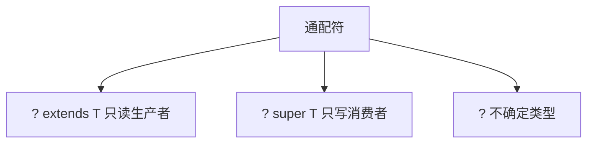

# L1-M1-S05 泛型与通配符

## 一句话结论

- 泛型解决的是“类型安全 + 代码复用”；通配符的核心是 PECS（Producer Extends, Consumer Super）。

## 规则图



## 核心知识点

### 1) 泛型价值

- 编译期类型检查，减少强制类型转换。
- 提升 API 可读性和约束能力。

### 2) PECS 原则

- 读取数据用 `? extends T`。
- 写入数据用 `? super T`。

### 3) 常见误区

- `List<Object>` 不是 `List<String>` 的父类型。
- 泛型在运行时类型擦除，不能直接 `new T()`。

## 示例代码

- [`../../examples/l1/GenericsWildcardDemo.java`](../../examples/l1/GenericsWildcardDemo.java)

## 高频面试题

### Q1：`? extends` 和 `? super` 有什么区别？

答题骨架：
1. `extends` 适合读取，不适合写入。
2. `super` 适合写入，读取时类型更宽。
3. 用 PECS 快速判断。

### Q2：什么是类型擦除？

答题骨架：
1. 泛型信息主要在编译期生效。
2. 运行期擦除为原始类型。
3. 解释由此带来的限制与桥接方法。

## 复习检查

- [ ] 能口述 PECS 原则
- [ ] 能解释 `List<Object>` 与 `List<String>` 关系
- [ ] 能举出类型擦除带来的限制

## Java 示例代码（含注释）

```java
import java.util.List;

public class GenericSnippet {
    static void printAll(List<? extends Number> list) {
        // extends: 适合读取（生产者）
        for (Number n : list) {
            System.out.println(n);
        }
    }

    static void addInt(List<? super Integer> list) {
        // super: 适合写入（消费者）
        list.add(1);
    }
}
```

