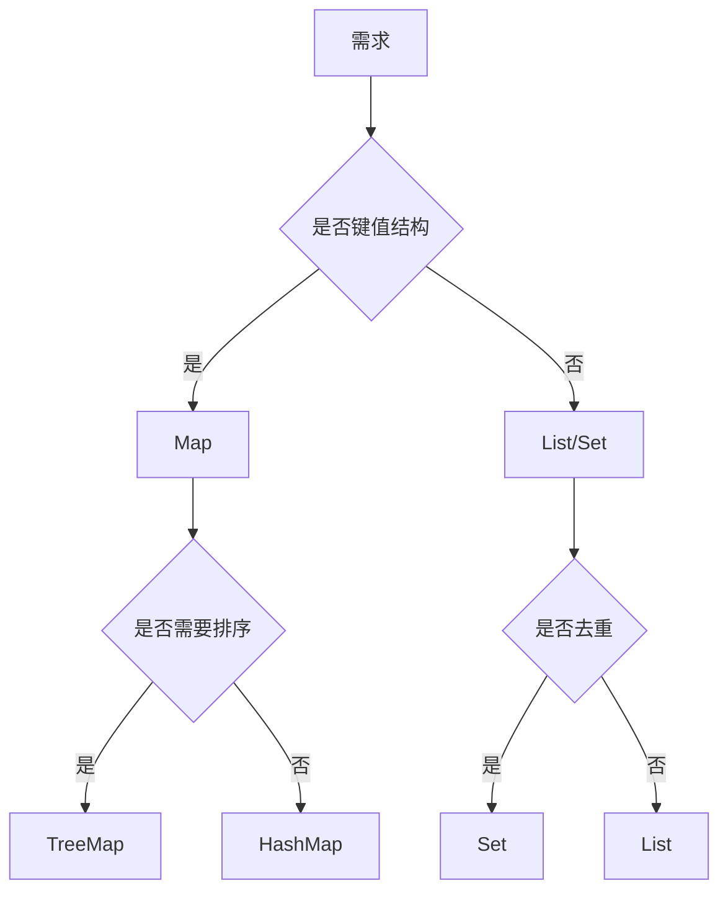

# L1-M1-S06 集合选型与复杂度

## 一句话结论

- 集合选型的本质是按操作模式做权衡：读写比例、是否有序、是否去重、线程安全需求。

## 选型图



## 核心知识点

### 1) 常见集合特性

| 集合 | 特点 | 适用场景 |
|---|---|---|
| `ArrayList` | 随机访问快，尾插高效 | 读多写少 |
| `LinkedList` | 理论上中间插入快 | 频繁中间插入（实际需压测） |
| `HashMap` | 平均 O(1) 查找 | 通用键值映射 |
| `TreeMap` | 有序，O(logn) | 需要范围查询 |
| `HashSet` | 去重，平均 O(1) | 去重集合 |

### 2) 复杂度不是全部

- 真实性能还受 CPU 缓存、对象分配、GC 压力影响。
- 选型要结合业务数据量和访问模式做压测。

### 3) 线程安全

- 并发读写不要用 `HashMap`。
- 多线程场景优先考虑 `ConcurrentHashMap` 或同步封装。

## 示例代码

- [`../../examples/l1/CollectionSelectionDemo.java`](../../examples/l1/CollectionSelectionDemo.java)

## 高频面试题

### Q1：`HashMap` 和 `TreeMap` 怎么选？

答题骨架：
1. 默认优先 `HashMap`（性能和通用性）。
2. 需要有序或范围查询用 `TreeMap`。
3. 补充线程安全和内存开销考虑。

### Q2：为什么 `ArrayList` 在很多场景比 `LinkedList` 快？

答题骨架：
1. 连续内存更友好，缓存命中率高。
2. 链表节点对象分散，指针跳转开销大。
3. 结合业务操作比例做最终判断。

## 复习检查

- [ ] 能画出集合选型决策树
- [ ] 能解释 O(1) 并非绝对快
- [ ] 能说明并发场景集合选择


## 前置知识

- 知道常见集合接口 `List/Set/Map`。
- 理解“查找、插入、删除”三类操作。
- 会写最基本的循环。

## 术语解释（零基础友好）

- **时间复杂度**：描述输入规模增长时操作耗时变化趋势。
- **最左前缀**：组合结构中按定义顺序命中前置部分的匹配规则（类比概念）。
- **缓存局部性**：连续内存访问更容易命中 CPU 缓存。

## 详细学习步骤（从不会到会）

1. 先明确业务操作比例：读多还是写多，是否需要去重和有序。
2. 按需求初选集合，再关注线程安全要求。
3. 通过小规模压测验证实际性能，不只看理论复杂度。
4. 最后形成“场景 -> 集合”的选型表并沉淀到代码规范。

## 常见错误与纠偏

- 只看复杂度表，不看真实访问模式和数据规模。
- 并发场景继续使用 `HashMap`，导致数据竞争。

## 学习动作

- 先手敲一次示例代码，确保可以独立运行。
- 用自己的话复述“定义 -> 原理 -> 场景 -> 边界”。
- 把本节关键结论写成 3 句速记卡，第二天复盘。

## 练习任务（建议动手）

1. 给定三种业务场景，分别选择最合适的集合并说明理由。
2. 写一个小程序比较 `ArrayList` 与 `LinkedList` 随机读取耗时。

## 练习参考方向

- 答案关键不是唯一集合，而是“理由是否成立”。
- 测试时要控制样本量与 JVM 预热影响。

## 复习检查

- [ ] 能在 90 秒内说明本节核心结论
- [ ] 能独立运行并解释示例代码输出
- [ ] 能说出至少 1 个常见错误与修正方式

## Java 示例代码（含注释，可直接运行）


**建议文件名：** `Main.java`  
**运行命令：** `javac Main.java && java Main`

**预期输出（示例）：**
```text
list0=A
mapK=1
```

```java
import java.util.ArrayList;
import java.util.HashMap;
import java.util.List;
import java.util.Map;

public class Main {
    public static void main(String[] args) {
        // 读多写少：ArrayList 是常见起点
        List<String> list = new ArrayList<>();
        list.add("A");

        // 键值映射默认优先 HashMap
        Map<String, Integer> map = new HashMap<>();
        map.put("k", 1);

        System.out.println("list0=" + list.get(0));
        System.out.println("mapK=" + map.get("k"));
    }
}
```
