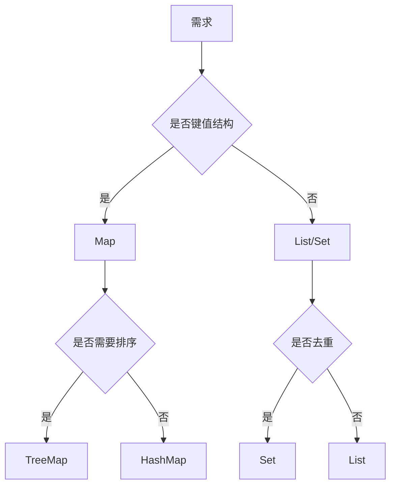

# L1-M1-S06 集合选型与复杂度

## 一句话结论

- 集合选型的本质是按操作模式做权衡：读写比例、是否有序、是否去重、线程安全需求。

## 选型图

## 核心知识点

### 1) 常见集合特性

| 集合 | 特点 | 适用场景 |
|---|---|---|
| `ArrayList` | 随机访问快，尾插高效 | 读多写少 |
| `LinkedList` | 理论上中间插入快 | 频繁中间插入（实际需压测） |
| `HashMap` | 平均 O(1) 查找 | 通用键值映射 |
| `TreeMap` | 有序，O(logn) | 需要范围查询 |
| `HashSet` | 去重，平均 O(1) | 去重集合 |

### 2) 复杂度不是全部

- 真实性能还受 CPU 缓存、对象分配、GC 压力影响。
- 选型要结合业务数据量和访问模式做压测。

### 3) 线程安全

- 并发读写不要用 `HashMap`。
- 多线程场景优先考虑 `ConcurrentHashMap` 或同步封装。

## 示例代码

- [`../../examples/l1/CollectionSelectionDemo.java`](../../examples/l1/CollectionSelectionDemo.java)

## 高频面试题

### Q1：`HashMap` 和 `TreeMap` 怎么选？

答题骨架：
1. 默认优先 `HashMap`（性能和通用性）。
2. 需要有序或范围查询用 `TreeMap`。
3. 补充线程安全和内存开销考虑。

### Q2：为什么 `ArrayList` 在很多场景比 `LinkedList` 快？

答题骨架：
1. 连续内存更友好，缓存命中率高。
2. 链表节点对象分散，指针跳转开销大。
3. 结合业务操作比例做最终判断。

## 复习检查

- [ ] 能画出集合选型决策树
- [ ] 能解释 O(1) 并非绝对快
- [ ] 能说明并发场景集合选择
