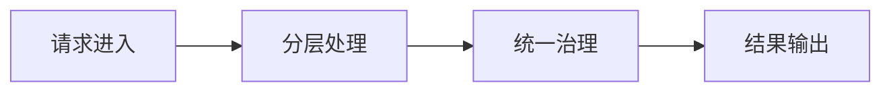

# L1-M3-S01 Spring Boot 分层开发

## 一句话结论

- Spring Boot 分层开发 是 L1 阶段的关键能力点，面试回答建议覆盖“定义、原理、场景、边界”。

## 结构图



## 核心知识点

1. 分层边界清晰是可维护性的第一前提。
2. 统一校验、异常、日志规范能显著降低问题定位成本。
3. 优先“简单可控”实现，再逐步演进到复杂治理。

## 高频面试题

### Q1：你如何在项目中落地“Spring Boot 分层开发”？

答题骨架：
1. 先说明业务目标和约束。
2. 再给可执行方案和关键指标。
3. 最后补充风险、边界与回退策略。

### Q2：Spring Boot 分层开发 的常见误区是什么？

答题骨架：
1. 说明常见错误做法。
2. 给出正确实践和适用条件。
3. 用一个真实场景收尾。


## 前置知识

- 知道 HTTP 请求和响应。
- 会写 Java 类与方法。
- 了解依赖注入的基本概念。

## 术语解释（零基础友好）

- **Controller**：处理请求入口、参数绑定与返回结果。
- **Service**：承载业务规则与流程编排。
- **Repository**：负责数据访问与持久化交互。

## 详细学习步骤（从不会到会）

1. 先按三层结构搭一个最小查询接口。
2. 把参数校验和异常处理放到统一位置。
3. 在 service 层只写业务逻辑，避免控制层膨胀。
4. 最后检查每层职责是否清晰且可测试。

## 常见错误与纠偏

- 把所有逻辑写在 Controller，导致维护困难。
- Service 直接拼 SQL 或处理 HTTP 细节，边界混乱。

## 学习动作

- 先手敲一次示例代码，确保可以独立运行。
- 用自己的话复述“定义 -> 原理 -> 场景 -> 边界”。
- 把本节关键结论写成 3 句速记卡，第二天复盘。

## 练习任务（建议动手）

1. 实现一个查询用户接口并按三层拆分。
2. 给 Service 增加一个业务规则并写注释解释原因。

## 练习参考方向

- 分层的关键是职责单一，不是目录形式。
- 接口返回要统一模型，便于前端和调用方使用。

## 复习检查

- [ ] 能在 90 秒内说明本节核心结论
- [ ] 能独立运行并解释示例代码输出
- [ ] 能说出至少 1 个常见错误与修正方式


## 错答示例 -> 修正答法 -> 打分差异（章级题解）

### 练习题目（围绕本章：SpringBoot分层开发）

- 请用 90 秒说明“定义 -> 原理 -> 场景 -> 风险 -> 验证”完整答题链路。
- 请补充至少 1 个线上或项目中的落地例子，并说明为什么这样做。

### 常见错答示例（低分版）

- 只说概念，不说机制：例如只背定义，无法解释底层流程。
- 只说优点，不说边界：没有说明适用条件与失败场景。
- 没有指标验证：讲完方案后不给量化结果或回归口径。

### 修正答法（高分版）

1. 先给结论：一句话说清本章知识点解决什么问题。
2. 再讲原理：用 2~3 个关键机制串起完整流程。
3. 再落场景：给出一个可复现的业务场景和方案选择理由。
4. 再说风险：列出至少 2 个常见坑和对应防护动作。
5. 最后验证：给出可观测指标（如延迟、错误率、吞吐、资源占用）与目标阈值。

### 打分差异示例（同题对比）

| 评分维度 | 错答（低分） | 修正（高分） | 提升点 |
|---|---|---|---|
| 概念准确 | 只背术语 | 术语 + 边界条件 | 避免概念混淆 |
| 原理完整 | 断点式描述 | 链路化描述 | 解释能力更强 |
| 场景匹配 | 空泛举例 | 贴近业务约束 | 方案更可信 |
| 风险意识 | 不提失败 | 提供兜底与回滚 | 工程可落地 |
| 验证闭环 | 无量化指标 | 指标 + 阈值 + 回归 | 可复盘可验收 |

### 自测动作

- 录音 90 秒复述本章答案，回听是否覆盖五段结构。
- 对照本章“复习检查”逐条打分，低于 80 分重答。
- 把本章答案压缩成 5 句话，训练高压场景下的表达稳定性。

## Java 示例代码（含注释，可直接运行）


**建议文件名：** `Main.java`  
**运行命令：** `javac Main.java && java Main`

**预期输出（示例）：**
```text
user-7
```

```java
class UserController {
    private final UserService userService = new UserService();

    String getUser(Long id) {
        // Controller 负责入口边界
        return userService.findNameById(id);
    }
}

class UserService {
    String findNameById(Long id) {
        // Service 负责业务逻辑
        return "user-" + id;
    }
}

public class Main {
    public static void main(String[] args) {
        UserController c = new UserController();
        System.out.println(c.getUser(7L));
    }
}
```
