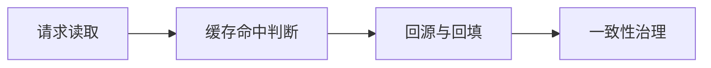

# L1-M3-S04 Redis 数据结构与场景

## 一句话结论

- Redis 数据结构与场景 是 L1 阶段的关键能力点，面试回答建议覆盖“定义、原理、场景、边界”。

## 结构图



## 核心知识点

1. 缓存方案设计要先明确一致性目标（强一致/最终一致）。
2. 穿透、击穿、雪崩要分别治理，不能“一招通吃”。
3. 高并发场景要准备降级与兜底，防止级联故障。

## 高频面试题

### Q1：你如何在项目中落地“Redis 数据结构与场景”？

答题骨架：
1. 先说明业务目标和约束。
2. 再给可执行方案和关键指标。
3. 最后补充风险、边界与回退策略。

### Q2：Redis 数据结构与场景 的常见误区是什么？

答题骨架：
1. 说明常见错误做法。
2. 给出正确实践和适用条件。
3. 用一个真实场景收尾。

## 学习动作

- 示例代码：[`examples/l2/CacheAsideDemo.java`](../../examples/l2/CacheAsideDemo.java)
- 复习时至少完成 3 次 60~90 秒口述训练。
- 对照 [`../13-面试题库编号与复习规则.md`](../13-面试题库编号与复习规则.md) 补齐表达。

## 复习检查

- [ ] 能在 90 秒内说明核心结论
- [ ] 能说明至少 1 个项目场景
- [ ] 能回答 1 个追问问题

## Java 示例代码（含注释，可直接运行）

**建议文件名：** `Main.java`  
**运行命令：** `javac Main.java && java Main`

**预期输出（示例）：**
```text
db:v1
cache:v1
```

```java
import java.util.Map;
import java.util.concurrent.ConcurrentHashMap;

public class Main {
    static final Map<String, String> cache = new ConcurrentHashMap<>();
    static final Map<String, String> db = new ConcurrentHashMap<>();

    public static void main(String[] args) {
        db.put("user:1", "v1");
        // Cache Aside：先查缓存，未命中回源并回填
        System.out.println(read("user:1"));
        System.out.println(read("user:1"));
    }

    static String read(String key) {
        String v = cache.get(key);
        if (v != null) return "cache:" + v;
        v = db.get(key);
        cache.put(key, v);
        return "db:" + v;
    }
}
```
