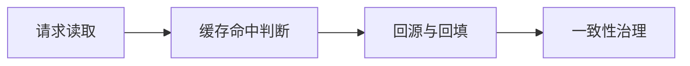

# L1-M3-S04 Redis 数据结构与场景

## 一句话结论

- Redis 数据结构与场景 是 L1 阶段的关键能力点，面试回答建议覆盖“定义、原理、场景、边界”。

## 结构图



## 核心知识点

1. 缓存方案设计要先明确一致性目标（强一致/最终一致）。
2. 穿透、击穿、雪崩要分别治理，不能“一招通吃”。
3. 高并发场景要准备降级与兜底，防止级联故障。

## 高频面试题

### Q1：你如何在项目中落地“Redis 数据结构与场景”？

答题骨架：
1. 先说明业务目标和约束。
2. 再给可执行方案和关键指标。
3. 最后补充风险、边界与回退策略。

### Q2：Redis 数据结构与场景 的常见误区是什么？

答题骨架：
1. 说明常见错误做法。
2. 给出正确实践和适用条件。
3. 用一个真实场景收尾。


## 前置知识

- 知道缓存用于减少数据库访问。
- 会使用键值对概念。
- 了解基础集合结构。

## 术语解释（零基础友好）

- **String**：最基础类型，适合缓存对象序列化后文本。
- **Hash**：适合存对象字段集合。
- **ZSet**：带分值排序集合，适合排行榜场景。

## 详细学习步骤（从不会到会）

1. 先按业务数据形态选结构，而不是先选命令。
2. 给不同 key 设置合理过期时间。
3. 为热点数据设计回源策略，避免缓存失效冲击 DB。
4. 最后梳理“场景 -> 结构 -> 命令”对照表。

## 常见错误与纠偏

- 所有数据都塞 String，导致查询和维护困难。
- 过期策略一刀切，产生同一时刻大量失效。

## 学习动作

- 先手敲一次示例代码，确保可以独立运行。
- 用自己的话复述“定义 -> 原理 -> 场景 -> 边界”。
- 把本节关键结论写成 3 句速记卡，第二天复盘。

## 练习任务（建议动手）

1. 设计一个用户信息缓存，分别用 String 与 Hash 对比。
2. 实现一个简单排行榜数据模型并说明为何用 ZSet。

## 练习参考方向

- 结构选择要看访问模式和更新粒度。
- 排行榜需要排序能力，ZSet 更自然。

## 复习检查

- [ ] 能在 90 秒内说明本节核心结论
- [ ] 能独立运行并解释示例代码输出
- [ ] 能说出至少 1 个常见错误与修正方式

## Java 示例代码（含注释，可直接运行）


**建议文件名：** `Main.java`  
**运行命令：** `javac Main.java && java Main`

**预期输出（示例）：**
```text
db:v1
cache:v1
```

```java
import java.util.Map;
import java.util.concurrent.ConcurrentHashMap;

public class Main {
    static final Map<String, String> cache = new ConcurrentHashMap<>();
    static final Map<String, String> db = new ConcurrentHashMap<>();

    public static void main(String[] args) {
        db.put("user:1", "v1");
        // Cache Aside：先查缓存，未命中回源并回填
        System.out.println(read("user:1"));
        System.out.println(read("user:1"));
    }

    static String read(String key) {
        String v = cache.get(key);
        if (v != null) return "cache:" + v;
        v = db.get(key);
        cache.put(key, v);
        return "db:" + v;
    }
}
```
