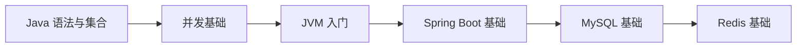

# L1 初级索引：基础夯实

## 阶段目标

- 能独立完成常见后端接口开发。
- 能清楚回答基础面试题（概念 + 原理 + 场景）。

## 阅读顺序

## 模块索引

| 顺序 | 模块 | 必会度 | 面试频率 | 文档状态 |
|---|---|---|---|---|
| 1 | Java 语法与面向对象 | P0 | 高 | TODO |
| 2 | 集合框架 | P0 | 高 | TODO |
| 3 | 并发基础 | P0 | 高 | TODO |
| 4 | JVM 入门 | P0 | 高 | TODO |
| 5 | Spring Boot 基础 | P0 | 高 | TODO |
| 6 | MySQL 基础 | P0 | 高 | TODO |
| 7 | Redis 基础 | P0 | 高 | TODO |

## 推荐学习产出

- 每个模块至少 1 张图 + 3 道问答 + 1 个示例。
- 每学完 2 个模块，做一次 30 分钟口述复盘。

## 关联索引

- 学习顺序总索引：[`../01-按学习顺序索引.md`](../01-按学习顺序索引.md)
- 面试频率索引：[`../02-按面试频率索引.md`](../02-按面试频率索引.md)
