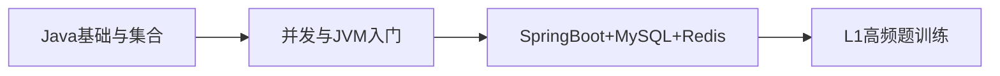

# L1 初级索引：基础夯实

## 阶段目标

- 能独立完成常见后端接口开发。
- 能清楚回答基础面试题（概念 + 原理 + 场景）。

## 学习路径图

## 模块清单

| 编号 | 主题 | 优先级 | 产出要求 | 状态 |
|---|---|---|---|---|
| 01 | [Java基础与集合](./01-Java基础与集合.md) | P0 | 1 图 + 3 题 + 1 示例 | DONE |
| 02 | [并发与JVM入门](./02-并发与JVM入门.md) | P0 | 2 图 + 3 题 + 1 示例 | DONE |
| 03 | [SpringBoot-MySQL-Redis开发主线](./03-SpringBoot-MySQL-Redis开发主线.md) | P0 | 主链路流程图 + 场景题 | DONE |
| 04 | [L1高频面试题与答题模板](./04-L1高频面试题与答题模板.md) | P0 | 题库 + 口述模板 | DONE |

## 子章节规划

- 子章节索引：[`00-L1子章节索引.md`](./00-L1子章节索引.md)
- 当前进度：M1（基础与集合）6/6 已完成

## 关联索引

- 学习顺序总索引：[`../01-按学习顺序索引.md`](../01-按学习顺序索引.md)
- 面试频率索引：[`../02-按面试频率索引.md`](../02-按面试频率索引.md)
- 专题索引：[`../03-按专题索引.md`](../03-按专题索引.md)
