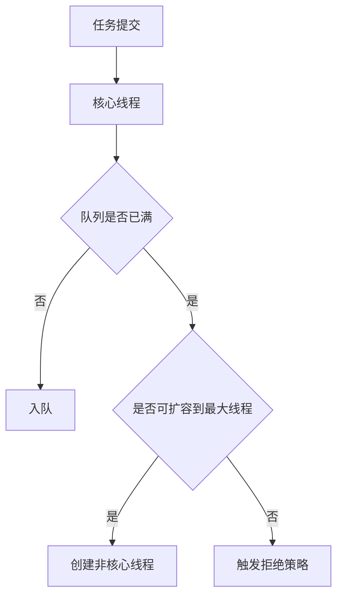

# L2-01 并发进阶与线程池调优

## 这是什么

本章关注并发问题的“可解释 + 可调优”：
- CAS / AQS / 锁升级
- 线程池参数调优与拒绝策略
- 并发故障定位（竞争、死锁、饥饿）

## 原理图



## 核心实践

### 1) 参数调优起点

- CPU 密集：线程数可从 `Ncpu + 1` 起步。
- IO 密集：线程数通常大于 CPU 核数，需压测确定。
- 不要只看“吞吐”，要同时看 RT、错误率、队列长度。

### 2) 指标驱动调优

必看指标：
- `activeCount`
- `queueSize`
- `completedTaskCount`
- 拒绝次数

示例：[`../../examples/l2/ThreadPoolSizingDemo.java`](../../examples/l2/ThreadPoolSizingDemo.java)

### 3) 高频故障点

- 无界队列导致 OOM 风险。
- 最大线程过大导致上下文切换开销增高。
- 拒绝策略选择不当导致雪崩扩散。

## 高频面试题

### Q1：线程池参数怎么配？

答题骨架：
1. 先按任务类型（CPU/IO）给初始值。
2. 明确队列上限和拒绝策略。
3. 通过压测与线上指标迭代调优。

### Q2：为什么不用 `Executors` 默认工厂？

答题骨架：
1. 默认工厂存在无界队列或无限线程风险。
2. 生产环境应显式指定队列容量和线程上限。
3. 便于容量评估和故障控制。

## 延伸阅读

- [advanced-java - 高并发](https://github.com/doocs/advanced-java/tree/main/docs/high-concurrency)
- [JavaGuide - 并发](https://github.com/Snailclimb/JavaGuide/tree/main/docs/java/concurrent)

## Java 示例代码（含注释）

```java
import java.util.concurrent.*;

public class ThreadPoolSnippet {
    public static void main(String[] args) {
        ThreadPoolExecutor pool = new ThreadPoolExecutor(
                2, 4, 30, TimeUnit.SECONDS,
                new ArrayBlockingQueue<>(8),
                new ThreadPoolExecutor.CallerRunsPolicy());
        // 显式设置队列与拒绝策略，避免默认无界风险
        pool.execute(() -> System.out.println("task"));
        pool.shutdown();
    }
}
```

