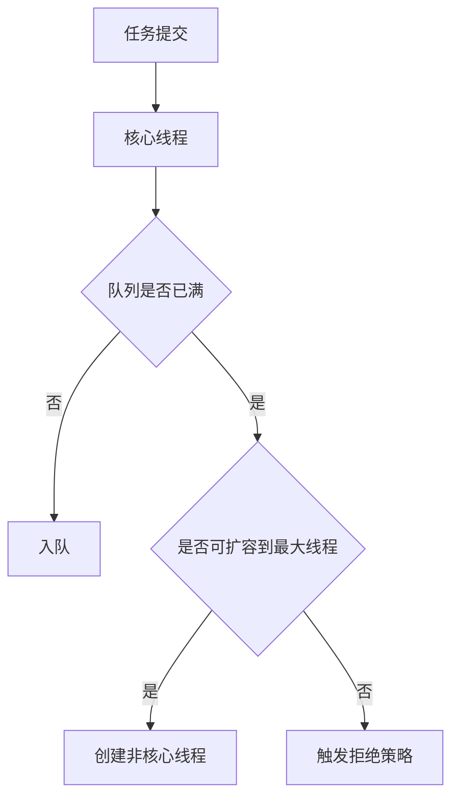

# L2-01 并发进阶与线程池调优

## 这是什么

本章关注并发问题的“可解释 + 可调优”：
- CAS / AQS / 锁升级
- 线程池参数调优与拒绝策略
- 并发故障定位（竞争、死锁、饥饿）

## 原理图



## 核心实践

### 1) 参数调优起点

- CPU 密集：线程数可从 `Ncpu + 1` 起步。
- IO 密集：线程数通常大于 CPU 核数，需压测确定。
- 不要只看“吞吐”，要同时看 RT、错误率、队列长度。

### 2) 指标驱动调优

必看指标：
- `activeCount`
- `queueSize`
- `completedTaskCount`
- 拒绝次数

示例：[`../../examples/l2/ThreadPoolSizingDemo.java`](../../examples/l2/ThreadPoolSizingDemo.java)

### 3) 高频故障点

- 无界队列导致 OOM 风险。
- 最大线程过大导致上下文切换开销增高。
- 拒绝策略选择不当导致雪崩扩散。

## 高频面试题

### Q1：线程池参数怎么配？

答题骨架：
1. 先按任务类型（CPU/IO）给初始值。
2. 明确队列上限和拒绝策略。
3. 通过压测与线上指标迭代调优。

### Q2：为什么不用 `Executors` 默认工厂？

答题骨架：
1. 默认工厂存在无界队列或无限线程风险。
2. 生产环境应显式指定队列容量和线程上限。
3. 便于容量评估和故障控制。

## 延伸阅读

- [advanced-java - 高并发](https://github.com/doocs/advanced-java/tree/main/docs/high-concurrency)
- [JavaGuide - 并发](https://github.com/Snailclimb/JavaGuide/tree/main/docs/java/concurrent)


## 前置知识

- 了解线程创建成本。
- 知道任务提交与执行。

## 术语解释（零基础友好）

- **核心线程**：优先保留处理任务的线程数量。
- **拒绝策略**：过载时新任务处理方式。

## 详细学习步骤（从不会到会）

1. 先用小参数构造线程池。
2. 观察队列变化与线程扩容。
3. 模拟过载验证拒绝策略。

## 常见错误与纠偏

- 默认工厂直接上线。
- 参数调整缺少指标依据。

## 学习动作

- 先手敲一次示例代码，确保可以独立运行。
- 用自己的话复述“定义 -> 原理 -> 场景 -> 边界”。
- 把本节关键结论写成 3 句速记卡，第二天复盘。

## 练习任务（建议动手）

1. 配置一个小队列触发拒绝。
2. 记录不同参数下响应时间变化。

## 练习参考方向

- 参数必须结合压测和监控迭代。

## 复习检查

- [ ] 能在 90 秒内说明本节核心结论
- [ ] 能独立运行并解释示例代码输出
- [ ] 能说出至少 1 个常见错误与修正方式

## Java 示例代码（含注释，可直接运行）


**建议文件名：** `Main.java`  
**运行命令：** `javac Main.java && java Main`

**预期输出（示例）：**
```text
result=task-ok
```

```java
import java.util.concurrent.ArrayBlockingQueue;
import java.util.concurrent.Future;
import java.util.concurrent.ThreadPoolExecutor;
import java.util.concurrent.TimeUnit;

public class Main {
    public static void main(String[] args) throws Exception {
        ThreadPoolExecutor pool = new ThreadPoolExecutor(
                1, 2, 30, TimeUnit.SECONDS,
                new ArrayBlockingQueue<>(4),
                new ThreadPoolExecutor.CallerRunsPolicy());

        // 显式指定队列与拒绝策略，避免默认无界风险
        Future<String> f = pool.submit(() -> "task-ok");
        System.out.println("result=" + f.get());
        pool.shutdown();
    }
}
```
