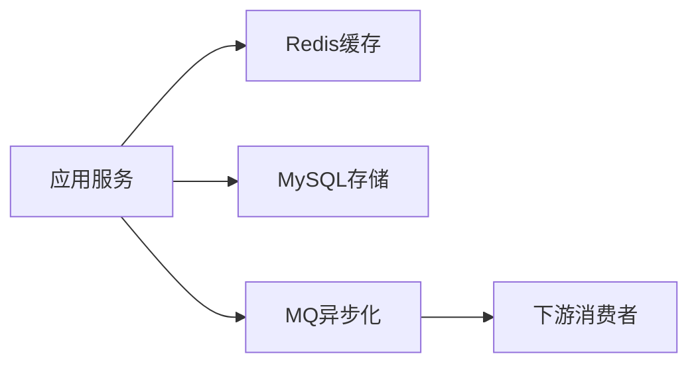

# L2-03 MySQL / Redis / MQ 性能与可靠性

## 这是什么

这是中级面试最常见的“中间件三件套”章节：
- MySQL：慢查询优化
- Redis：缓存一致性与高并发缓存问题
- MQ：消息可靠性与幂等

## 关联关系图



## 核心知识点

### 1) MySQL 优化

- 先看执行计划（`EXPLAIN`），识别全表扫描和回表开销。
- 组合索引遵循最左前缀匹配。
- SQL 优化要结合业务访问模式，不只看单条语句。

### 2) Redis 一致性

- 常见模式：先更新 DB，再删除缓存。
- 缓存问题：穿透、击穿、雪崩。
- 常见治理：布隆过滤、互斥锁、随机过期、限流降级。

示例：[`../../examples/l2/CacheAsideDemo.java`](../../examples/l2/CacheAsideDemo.java)

### 3) MQ 可靠性

- 生产者确认 + Broker 持久化 + 消费者手动确认。
- 幂等消费：业务唯一键 / 去重表 / token 机制。
- 顺序消费：按 key 分区，保证同 key 顺序。

## 高频面试题

### Q1：如何保证消息不丢失？

答题骨架：
1. 生产端：发送确认与失败重试。
2. Broker：持久化与副本机制。
3. 消费端：消费确认与重试死信。

### Q2：缓存和数据库一致性怎么保证？

答题骨架：
1. 先更新 DB，再删缓存。
2. 处理并发读写时序问题（延迟双删或订阅 binlog）。
3. 明确一致性目标（强一致/最终一致）。

## 延伸阅读

- [advanced-java - 缓存与 MQ](https://github.com/doocs/advanced-java/tree/main/docs/high-concurrency)
- [JavaGuide - 数据库与消息队列](https://github.com/Snailclimb/JavaGuide/tree/main/docs/database)


## 前置知识

- 会写基本 SQL。
- 知道主键和索引概念。

## 术语解释（零基础友好）

- **执行计划**：数据库选择语句执行路径的说明。
- **索引失效**：优化器未走预期索引导致扫描增加。

## 详细学习步骤（从不会到会）

1. 先看执行计划定位瓶颈。
2. 重写 SQL 或调整索引。
3. 优化后做对比验证。

## 常见错误与纠偏

- 只加索引不看查询模式。
- 优化后不做回归验证。

## 学习动作

- 先手敲一次示例代码，确保可以独立运行。
- 用自己的话复述“定义 -> 原理 -> 场景 -> 边界”。
- 把本节关键结论写成 3 句速记卡，第二天复盘。

## 练习任务（建议动手）

1. 给慢 SQL 设计优化方案并解释。
2. 写出两种索引失效案例。

## 练习参考方向

- 优化一定要“前后对比+可复现”。

## 复习检查

- [ ] 能在 90 秒内说明本节核心结论
- [ ] 能独立运行并解释示例代码输出
- [ ] 能说出至少 1 个常见错误与修正方式


## 完整案例 Walkthrough（L2/L3 深挖）

### 场景输入

- 订单查询接口平均耗时 80ms，某次版本后升至 600ms。

### 线上现象

- 数据库 CPU 飙高，慢查询日志持续出现相同 SQL。

### 证据采集

- 查看 EXPLAIN、扫描行数、索引命中情况和慢日志采样。

### 定位分析

- 定位到 where 条件函数化导致索引失效，回表成本显著上升。

### 修复动作

- 重写 SQL 避免函数操作索引列，补充联合索引并减少不必要字段回表。

### 回归验证

- 灰度发布后对比 RT、QPS、慢日志数量与数据库资源占用。

### 实战排障清单

- 先定位最慢 SQL，再看全局资源。
- 避免“先加索引后解释”。
- 验证优化是否影响写入性能与锁冲突。


## 错答示例 -> 修正答法 -> 打分差异（章级题解）

### 练习题目（围绕本章：MySQL-Redis-MQ性能与可靠性）

- 请用 90 秒说明“定义 -> 原理 -> 场景 -> 风险 -> 验证”完整答题链路。
- 请补充至少 1 个线上或项目中的落地例子，并说明为什么这样做。

### 常见错答示例（低分版）

- 只说概念，不说机制：例如只背定义，无法解释底层流程。
- 只说优点，不说边界：没有说明适用条件与失败场景。
- 没有指标验证：讲完方案后不给量化结果或回归口径。

### 修正答法（高分版）

1. 先给结论：一句话说清本章知识点解决什么问题。
2. 再讲原理：用 2~3 个关键机制串起完整流程。
3. 再落场景：给出一个可复现的业务场景和方案选择理由。
4. 再说风险：列出至少 2 个常见坑和对应防护动作。
5. 最后验证：给出可观测指标（如延迟、错误率、吞吐、资源占用）与目标阈值。

### 打分差异示例（同题对比）

| 评分维度 | 错答（低分） | 修正（高分） | 提升点 |
|---|---|---|---|
| 概念准确 | 只背术语 | 术语 + 边界条件 | 避免概念混淆 |
| 原理完整 | 断点式描述 | 链路化描述 | 解释能力更强 |
| 场景匹配 | 空泛举例 | 贴近业务约束 | 方案更可信 |
| 风险意识 | 不提失败 | 提供兜底与回滚 | 工程可落地 |
| 验证闭环 | 无量化指标 | 指标 + 阈值 + 回归 | 可复盘可验收 |

### 自测动作

- 录音 90 秒复述本章答案，回听是否覆盖五段结构。
- 对照本章“复习检查”逐条打分，低于 80 分重答。
- 把本章答案压缩成 5 句话，训练高压场景下的表达稳定性。

## Java 示例代码（含注释，可直接运行）


**建议文件名：** `Main.java`  
**运行命令：** `javac Main.java && java Main`

**预期输出（示例）：**
```text
SELECT id, name FROM user WHERE phone = ?
```

```java
public class Main {
    public static void main(String[] args) {
        // 索引友好写法：避免在索引列上做函数操作
        String sql = "SELECT id, name FROM user WHERE phone = ?";
        // 实战中应结合 EXPLAIN 验证执行计划
        System.out.println(sql);
    }
}
```
