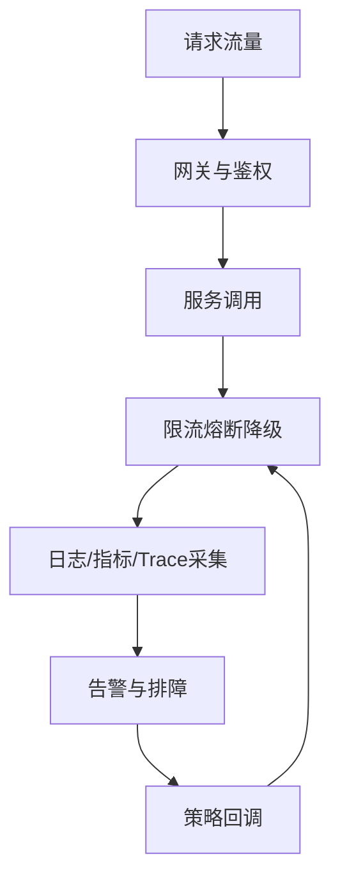

# L2-04 微服务治理与可观测性

## 这是什么

当系统拆成多个服务后，核心问题从“能跑”变成“可控”：
- 服务治理：注册发现、网关、配置中心
- 稳定性治理：限流、熔断、降级
- 可观测性：日志、指标、链路追踪

## 治理闭环图



## 核心实践

### 1) 限流

- 入口限流（网关）+ 服务内限流（热点接口）。
- 常见算法：令牌桶、漏桶、滑动窗口。

### 2) 熔断与降级

- 熔断用于快速失败，避免故障扩散。
- 降级提供兜底响应，保护核心链路。

### 3) 可观测性三件套

- Logs：定位错误细节。
- Metrics：监控系统状态。
- Trace：定位跨服务调用瓶颈。

## 高频面试题

### Q1：微服务如何做稳定性治理？

答题骨架：
1. 识别核心链路。
2. 在入口和核心服务做限流。
3. 下游依赖设置熔断与超时。
4. 配合降级策略保证业务可用。

### Q2：线上慢请求怎么查？

答题骨架：
1. 先看接口 RT 与错误率趋势。
2. 用 Trace 定位慢在哪个服务。
3. 结合日志和 SQL 分析根因。
4. 回归验证并补监控。

## 延伸阅读

- [advanced-java - 微服务/高可用](https://github.com/doocs/advanced-java/tree/main/docs/micro-services)
- [source-code-hunter - Spring Cloud](https://github.com/doocs/source-code-hunter/tree/main/docs/SpringCloud)


## 前置知识

- 理解 HTTP 请求流程。
- 会写基础 Java 类。

## 术语解释（零基础友好）

- **分层**：按职责拆分控制层、业务层、数据层。
- **治理**：统一规范和监控确保可维护。

## 详细学习步骤（从不会到会）

1. 先搭最小功能链路。
2. 抽离公共校验和异常处理。
3. 验证扩展时对旧代码影响最小。

## 常见错误与纠偏

- 职责边界混乱。
- 公共逻辑重复分散。

## 学习动作

- 先手敲一次示例代码，确保可以独立运行。
- 用自己的话复述“定义 -> 原理 -> 场景 -> 边界”。
- 把本节关键结论写成 3 句速记卡，第二天复盘。

## 练习任务（建议动手）

1. 按三层实现一个查询接口。
2. 补充统一异常处理并验证返回格式。

## 练习参考方向

- 分层目标是降低维护成本与认知负担。

## 复习检查

- [ ] 能在 90 秒内说明本节核心结论
- [ ] 能独立运行并解释示例代码输出
- [ ] 能说出至少 1 个常见错误与修正方式

## Java 示例代码（含注释，可直接运行）


**建议文件名：** `Main.java`  
**运行命令：** `javac Main.java && java Main`

**预期输出（示例）：**
```text
user-7
```

```java
class UserController {
    private final UserService userService = new UserService();

    String getUser(Long id) {
        // Controller 负责入口边界
        return userService.findNameById(id);
    }
}

class UserService {
    String findNameById(Long id) {
        // Service 负责业务逻辑
        return "user-" + id;
    }
}

public class Main {
    public static void main(String[] args) {
        UserController c = new UserController();
        System.out.println(c.getUser(7L));
    }
}
```
