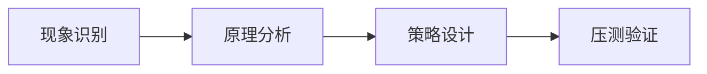

# L2-M1-S03 线程池参数设计

## 一句话结论

- 线程池参数设计 是 L2 阶段的关键能力点，面试回答建议覆盖“定义、原理、场景、边界”。

## 结构图



## 核心知识点

1. 先区分并发问题类型：竞争、死锁、饥饿、队列积压。
2. 通过线程状态、队列长度、耗时分位数定位瓶颈。
3. 方案必须包含容量保护与回归验证，避免“修一处炸一片”。

## 高频面试题

### Q1：你如何在项目中落地“线程池参数设计”？

答题骨架：
1. 先说明业务目标和约束。
2. 再给可执行方案和关键指标。
3. 最后补充风险、边界与回退策略。

### Q2：线程池参数设计 的常见误区是什么？

答题骨架：
1. 说明常见错误做法。
2. 给出正确实践和适用条件。
3. 用一个真实场景收尾。


## 前置知识

- 了解线程创建成本。
- 知道任务提交与执行。

## 术语解释（零基础友好）

- **核心线程**：优先保留处理任务的线程数量。
- **拒绝策略**：过载时新任务处理方式。

## 详细学习步骤（从不会到会）

1. 先用小参数构造线程池。
2. 观察队列变化与线程扩容。
3. 模拟过载验证拒绝策略。

## 常见错误与纠偏

- 默认工厂直接上线。
- 参数调整缺少指标依据。

## 学习动作

- 先手敲一次示例代码，确保可以独立运行。
- 用自己的话复述“定义 -> 原理 -> 场景 -> 边界”。
- 把本节关键结论写成 3 句速记卡，第二天复盘。

## 练习任务（建议动手）

1. 配置一个小队列触发拒绝。
2. 记录不同参数下响应时间变化。

## 练习参考方向

- 参数必须结合压测和监控迭代。

## 复习检查

- [ ] 能在 90 秒内说明本节核心结论
- [ ] 能独立运行并解释示例代码输出
- [ ] 能说出至少 1 个常见错误与修正方式

## Java 示例代码（含注释，可直接运行）


**建议文件名：** `Main.java`  
**运行命令：** `javac Main.java && java Main`

**预期输出（示例）：**
```text
result=task-ok
```

```java
import java.util.concurrent.ArrayBlockingQueue;
import java.util.concurrent.Future;
import java.util.concurrent.ThreadPoolExecutor;
import java.util.concurrent.TimeUnit;

public class Main {
    public static void main(String[] args) throws Exception {
        ThreadPoolExecutor pool = new ThreadPoolExecutor(
                1, 2, 30, TimeUnit.SECONDS,
                new ArrayBlockingQueue<>(4),
                new ThreadPoolExecutor.CallerRunsPolicy());

        // 显式指定队列与拒绝策略，避免默认无界风险
        Future<String> f = pool.submit(() -> "task-ok");
        System.out.println("result=" + f.get());
        pool.shutdown();
    }
}
```
