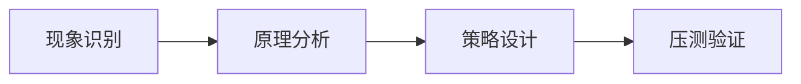

# L2-M1-S04 拒绝策略与容量保护

## 一句话结论

- 拒绝策略与容量保护 是 L2 阶段的关键能力点，面试回答建议覆盖“定义、原理、场景、边界”。

## 结构图



## 核心知识点

1. 先区分并发问题类型：竞争、死锁、饥饿、队列积压。
2. 通过线程状态、队列长度、耗时分位数定位瓶颈。
3. 方案必须包含容量保护与回归验证，避免“修一处炸一片”。

## 高频面试题

### Q1：你如何在项目中落地“拒绝策略与容量保护”？

答题骨架：
1. 先说明业务目标和约束。
2. 再给可执行方案和关键指标。
3. 最后补充风险、边界与回退策略。

### Q2：拒绝策略与容量保护 的常见误区是什么？

答题骨架：
1. 说明常见错误做法。
2. 给出正确实践和适用条件。
3. 用一个真实场景收尾。

## 学习动作

- 示例代码：[`examples/l2/ThreadPoolSizingDemo.java`](../../examples/l2/ThreadPoolSizingDemo.java)
- 复习时至少完成 3 次 60~90 秒口述训练。
- 对照 [`../13-面试题库编号与复习规则.md`](../13-面试题库编号与复习规则.md) 补齐表达。

## 复习检查

- [ ] 能在 90 秒内说明核心结论
- [ ] 能说明至少 1 个项目场景
- [ ] 能回答 1 个追问问题

## Java 示例代码（含注释，可直接运行）

**建议文件名：** `Main.java`  
**运行命令：** `javac Main.java && java Main`

**预期输出（示例）：**
```text
nodes=6
```

```java
public class Main {
    public static void main(String[] args) {
        long peakQps = 5000;
        int singleNodeQps = 1200;
        double redundancy = 1.3;
        // 容量估算 = 峰值QPS / 单机能力 * 冗余系数
        int nodes = (int) Math.ceil((peakQps / (double) singleNodeQps) * redundancy);
        System.out.println("nodes=" + nodes);
    }
}
```
