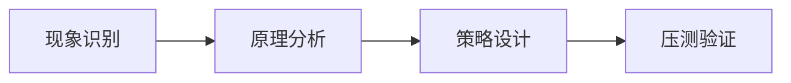

# L2-M1-S05 并发问题定位方法

## 一句话结论

- 并发问题定位方法 是 L2 阶段的关键能力点，面试回答建议覆盖“定义、原理、场景、边界”。

## 结构图



## 核心知识点

1. 先区分并发问题类型：竞争、死锁、饥饿、队列积压。
2. 通过线程状态、队列长度、耗时分位数定位瓶颈。
3. 方案必须包含容量保护与回归验证，避免“修一处炸一片”。

## 高频面试题

### Q1：你如何在项目中落地“并发问题定位方法”？

答题骨架：
1. 先说明业务目标和约束。
2. 再给可执行方案和关键指标。
3. 最后补充风险、边界与回退策略。

### Q2：并发问题定位方法 的常见误区是什么？

答题骨架：
1. 说明常见错误做法。
2. 给出正确实践和适用条件。
3. 用一个真实场景收尾。


## 前置知识

- 知道线程可并行执行任务。
- 会写最小可运行程序。

## 术语解释（零基础友好）

- **并发**：同一时段处理多个任务。
- **同步**：控制多线程访问顺序与一致性。

## 详细学习步骤（从不会到会）

1. 先运行最小并发示例。
2. 加入同步控制验证正确性。
3. 观察日志定位时序问题。

## 常见错误与纠偏

- 只看结果不看线程时序。
- 没有退出条件导致线程泄漏。

## 学习动作

- 先手敲一次示例代码，确保可以独立运行。
- 用自己的话复述“定义 -> 原理 -> 场景 -> 边界”。
- 把本节关键结论写成 3 句速记卡，第二天复盘。

## 练习任务（建议动手）

1. 实现主子线程协作示例。
2. 模拟竞态并给修复方案。

## 练习参考方向

- 并发问题先复现，再定位，再修复。

## 复习检查

- [ ] 能在 90 秒内说明本节核心结论
- [ ] 能独立运行并解释示例代码输出
- [ ] 能说出至少 1 个常见错误与修正方式

## Java 示例代码（含注释，可直接运行）


**建议文件名：** `Main.java`  
**运行命令：** `javac Main.java && java Main`

**预期输出（示例）：**
```text
worker running
main done
```

```java
public class Main {
    public static void main(String[] args) throws InterruptedException {
        Thread worker = new Thread(() -> {
            // 子线程执行任务
            System.out.println("worker running");
        });

        worker.start();
        // join 确保主线程等待子线程结束
        worker.join();
        System.out.println("main done");
    }
}
```
