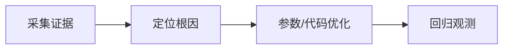

# L2-M2-S01 GC 指标解读

## 一句话结论

- GC 指标解读 是 L2 阶段的关键能力点，面试回答建议覆盖“定义、原理、场景、边界”。

## 结构图



## 核心知识点

1. 先采集 GC 日志、线程栈、堆快照，再下结论。
2. 区分分配速率问题、晋升问题和内存泄漏问题。
3. 参数调整要小步迭代，和业务流量峰值联动验证。

## 高频面试题

### Q1：你如何在项目中落地“GC 指标解读”？

答题骨架：
1. 先说明业务目标和约束。
2. 再给可执行方案和关键指标。
3. 最后补充风险、边界与回退策略。

### Q2：GC 指标解读 的常见误区是什么？

答题骨架：
1. 说明常见错误做法。
2. 给出正确实践和适用条件。
3. 用一个真实场景收尾。


## 前置知识

- 了解 JVM 基本结构。
- 会读取基础日志输出。

## 术语解释（零基础友好）

- **GC**：垃圾回收机制。
- **OOM**：内存不足导致无法分配对象。

## 详细学习步骤（从不会到会）

1. 先采集证据（日志/快照）。
2. 定位问题类型（分配速率/泄漏）。
3. 小步调整并回归验证。

## 常见错误与纠偏

- 先调参数后取证。
- 单次优化结果直接固化。

## 学习动作

- 先手敲一次示例代码，确保可以独立运行。
- 用自己的话复述“定义 -> 原理 -> 场景 -> 边界”。
- 把本节关键结论写成 3 句速记卡，第二天复盘。

## 练习任务（建议动手）

1. 设计一次 Full GC 排查流程。
2. 写出 OOM 分类与首查项。

## 练习参考方向

- 证据优先，结论后置。

## 复习检查

- [ ] 能在 90 秒内说明本节核心结论
- [ ] 能独立运行并解释示例代码输出
- [ ] 能说出至少 1 个常见错误与修正方式

## Java 示例代码（含注释，可直接运行）


**建议文件名：** `Main.java`  
**运行命令：** `javac Main.java && java Main`

**预期输出（示例）：**
```text
local=1
heapSize=256
```

```java
public class Main {
    public static void main(String[] args) {
        int local = 1;               // 栈上局部变量
        byte[] bytes = new byte[256]; // 堆上对象
        // 类元数据位于方法区（JDK8+ 为元空间）
        System.out.println("local=" + local);
        System.out.println("heapSize=" + bytes.length);
    }
}
```
