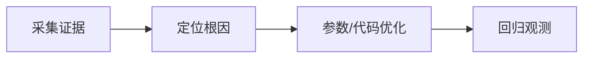

# L2-M2-S03 堆快照分析流程

## 一句话结论

- 堆快照分析流程 是 L2 阶段的关键能力点，面试回答建议覆盖“定义、原理、场景、边界”。

## 结构图



## 核心知识点

1. 先采集 GC 日志、线程栈、堆快照，再下结论。
2. 区分分配速率问题、晋升问题和内存泄漏问题。
3. 参数调整要小步迭代，和业务流量峰值联动验证。

## 高频面试题

### Q1：你如何在项目中落地“堆快照分析流程”？

答题骨架：
1. 先说明业务目标和约束。
2. 再给可执行方案和关键指标。
3. 最后补充风险、边界与回退策略。

### Q2：堆快照分析流程 的常见误区是什么？

答题骨架：
1. 说明常见错误做法。
2. 给出正确实践和适用条件。
3. 用一个真实场景收尾。


## 前置知识

- 理解系统由多个组件协作。
- 会读基础架构图。

## 术语解释（零基础友好）

- **容量评估**：根据流量模型估算系统资源需求。
- **治理**：通过规范和机制持续改进系统质量。

## 详细学习步骤（从不会到会）

1. 先明确业务目标和瓶颈。
2. 设计分层方案并列出取舍。
3. 通过压测与演练验证方案有效性。

## 常见错误与纠偏

- 只讲技术名词不讲业务约束。
- 无验证直接上线复杂方案。

## 学习动作

- 先手敲一次示例代码，确保可以独立运行。
- 用自己的话复述“定义 -> 原理 -> 场景 -> 边界”。
- 把本节关键结论写成 3 句速记卡，第二天复盘。

## 练习任务（建议动手）

1. 为一个高并发场景画架构图并写取舍。
2. 给方案补充回滚与降级预案。

## 练习参考方向

- 架构题关键是“目标-约束-取舍-验证”。

## 复习检查

- [ ] 能在 90 秒内说明本节核心结论
- [ ] 能独立运行并解释示例代码输出
- [ ] 能说出至少 1 个常见错误与修正方式

## Java 示例代码（含注释，可直接运行）


**建议文件名：** `Main.java`  
**运行命令：** `javac Main.java && java Main`

**预期输出（示例）：**
```text
nodes=6
```

```java
public class Main {
    public static void main(String[] args) {
        long peakQps = 5000;
        int singleNodeQps = 1200;
        double redundancy = 1.3;
        // 容量估算 = 峰值QPS / 单机能力 * 冗余系数
        int nodes = (int) Math.ceil((peakQps / (double) singleNodeQps) * redundancy);
        System.out.println("nodes=" + nodes);
    }
}
```
