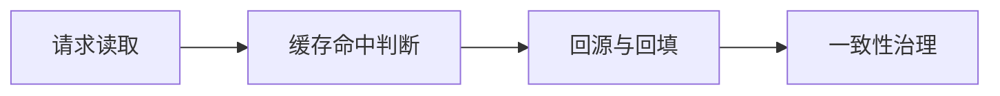

# L2-M3-S03 缓存一致性方案

## 一句话结论

- 缓存一致性方案 是 L2 阶段的关键能力点，面试回答建议覆盖“定义、原理、场景、边界”。

## 结构图



## 核心知识点

1. 缓存方案设计要先明确一致性目标（强一致/最终一致）。
2. 穿透、击穿、雪崩要分别治理，不能“一招通吃”。
3. 高并发场景要准备降级与兜底，防止级联故障。

## 高频面试题

### Q1：你如何在项目中落地“缓存一致性方案”？

答题骨架：
1. 先说明业务目标和约束。
2. 再给可执行方案和关键指标。
3. 最后补充风险、边界与回退策略。

### Q2：缓存一致性方案 的常见误区是什么？

答题骨架：
1. 说明常见错误做法。
2. 给出正确实践和适用条件。
3. 用一个真实场景收尾。


## 前置知识

- 理解缓存基本作用。
- 知道 key-value 数据模型。

## 术语解释（零基础友好）

- **命中率**：请求直接从缓存返回的比例。
- **缓存雪崩**：大量 key 同时失效导致回源洪峰。

## 详细学习步骤（从不会到会）

1. 先明确一致性目标。
2. 实现读写流程并加过期策略。
3. 补充高峰期保护策略。

## 常见错误与纠偏

- 缓存更新时序错误。
- 过期策略同一时刻集中失效。

## 学习动作

- 先手敲一次示例代码，确保可以独立运行。
- 用自己的话复述“定义 -> 原理 -> 场景 -> 边界”。
- 把本节关键结论写成 3 句速记卡，第二天复盘。

## 练习任务（建议动手）

1. 实现最小缓存旁路读写流程。
2. 设计雪崩治理策略清单。

## 练习参考方向

- 缓存设计要兼顾性能、一致性与可用性。

## 复习检查

- [ ] 能在 90 秒内说明本节核心结论
- [ ] 能独立运行并解释示例代码输出
- [ ] 能说出至少 1 个常见错误与修正方式

## Java 示例代码（含注释，可直接运行）


**建议文件名：** `Main.java`  
**运行命令：** `javac Main.java && java Main`

**预期输出（示例）：**
```text
db:v1
cache:v1
```

```java
import java.util.Map;
import java.util.concurrent.ConcurrentHashMap;

public class Main {
    static final Map<String, String> cache = new ConcurrentHashMap<>();
    static final Map<String, String> db = new ConcurrentHashMap<>();

    public static void main(String[] args) {
        db.put("user:1", "v1");
        // Cache Aside：先查缓存，未命中回源并回填
        System.out.println(read("user:1"));
        System.out.println(read("user:1"));
    }

    static String read(String key) {
        String v = cache.get(key);
        if (v != null) return "cache:" + v;
        v = db.get(key);
        cache.put(key, v);
        return "db:" + v;
    }
}
```
