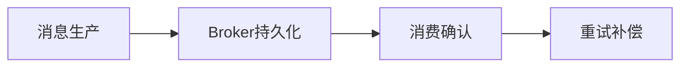

# L2-M3-S05 MQ 可靠性与幂等

## 一句话结论

- MQ 可靠性与幂等 是 L2 阶段的关键能力点，面试回答建议覆盖“定义、原理、场景、边界”。

## 结构图



## 核心知识点

1. 可靠性要从生产端、存储端、消费端三段设计。
2. 幂等是消费端必选项，不是可选优化。
3. 顺序、积压、重试策略要与业务时效目标匹配。

## 高频面试题

### Q1：你如何在项目中落地“MQ 可靠性与幂等”？

答题骨架：
1. 先说明业务目标和约束。
2. 再给可执行方案和关键指标。
3. 最后补充风险、边界与回退策略。

### Q2：MQ 可靠性与幂等 的常见误区是什么？

答题骨架：
1. 说明常见错误做法。
2. 给出正确实践和适用条件。
3. 用一个真实场景收尾。


## 前置知识

- 知道异步解耦基本概念。
- 会处理简单消息消费逻辑。

## 术语解释（零基础友好）

- **幂等**：同一消息重复消费结果一致。
- **重试**：消费失败后按策略再次处理。

## 详细学习步骤（从不会到会）

1. 梳理生产、存储、消费三段可靠性。
2. 实现幂等去重。
3. 设计重试与死信兜底。

## 常见错误与纠偏

- 只关注发送成功，不关注消费确认。
- 重复消费未去重。

## 学习动作

- 先手敲一次示例代码，确保可以独立运行。
- 用自己的话复述“定义 -> 原理 -> 场景 -> 边界”。
- 把本节关键结论写成 3 句速记卡，第二天复盘。

## 练习任务（建议动手）

1. 写一个消息幂等消费示例。
2. 设计失败重试和死信处理流程。

## 练习参考方向

- 可靠性需要端到端设计，不是单点配置。

## 复习检查

- [ ] 能在 90 秒内说明本节核心结论
- [ ] 能独立运行并解释示例代码输出
- [ ] 能说出至少 1 个常见错误与修正方式


## 完整案例 Walkthrough（L2/L3 深挖）

### 场景输入

- 消费组重平衡后出现重复消费，且少量消息处理超时。

### 线上现象

- 订单状态偶发重复变更，业务方反馈数据不一致。

### 证据采集

- 核对消息 ID、消费日志、重试记录与业务幂等键命中率。

### 定位分析

- 定位为幂等校验缺失 + 重试策略和业务状态机未对齐。

### 修复动作

- 引入业务唯一键去重，消费端幂等检查前置，并完善重试与死信处理。

### 回归验证

- 压测重复消息场景，验证重复消费率、死信量、最终一致性。

### 实战排障清单

- 可靠性必须覆盖生产端、Broker、消费端。
- 幂等逻辑放在业务处理前。
- 死信队列要有可观测与补偿任务。


## 错答示例 -> 修正答法 -> 打分差异（章级题解）

### 练习题目（围绕本章：MQ可靠性与幂等）

- 请用 90 秒说明“定义 -> 原理 -> 场景 -> 风险 -> 验证”完整答题链路。
- 请补充至少 1 个线上或项目中的落地例子，并说明为什么这样做。

### 常见错答示例（低分版）

- 只说概念，不说机制：例如只背定义，无法解释底层流程。
- 只说优点，不说边界：没有说明适用条件与失败场景。
- 没有指标验证：讲完方案后不给量化结果或回归口径。

### 修正答法（高分版）

1. 先给结论：一句话说清本章知识点解决什么问题。
2. 再讲原理：用 2~3 个关键机制串起完整流程。
3. 再落场景：给出一个可复现的业务场景和方案选择理由。
4. 再说风险：列出至少 2 个常见坑和对应防护动作。
5. 最后验证：给出可观测指标（如延迟、错误率、吞吐、资源占用）与目标阈值。

### 打分差异示例（同题对比）

| 评分维度 | 错答（低分） | 修正（高分） | 提升点 |
|---|---|---|---|
| 概念准确 | 只背术语 | 术语 + 边界条件 | 避免概念混淆 |
| 原理完整 | 断点式描述 | 链路化描述 | 解释能力更强 |
| 场景匹配 | 空泛举例 | 贴近业务约束 | 方案更可信 |
| 风险意识 | 不提失败 | 提供兜底与回滚 | 工程可落地 |
| 验证闭环 | 无量化指标 | 指标 + 阈值 + 回归 | 可复盘可验收 |

### 自测动作

- 录音 90 秒复述本章答案，回听是否覆盖五段结构。
- 对照本章“复习检查”逐条打分，低于 80 分重答。
- 把本章答案压缩成 5 句话，训练高压场景下的表达稳定性。

## Java 示例代码（含注释，可直接运行）


**建议文件名：** `Main.java`  
**运行命令：** `javac Main.java && java Main`

**预期输出（示例）：**
```text
handle:msg-1
skip:msg-1
```

```java
import java.util.HashSet;
import java.util.Set;

public class Main {
    private static final Set<String> processed = new HashSet<>();

    public static void main(String[] args) {
        consume("msg-1");
        consume("msg-1");
    }

    static void consume(String messageId) {
        // 幂等去重：重复消息直接跳过
        if (!processed.add(messageId)) {
            System.out.println("skip:" + messageId);
            return;
        }
        System.out.println("handle:" + messageId);
    }
}
```
