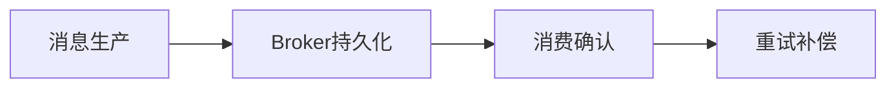

# L2-M3-S05 MQ 可靠性与幂等

## 一句话结论

- MQ 可靠性与幂等 是 L2 阶段的关键能力点，面试回答建议覆盖“定义、原理、场景、边界”。

## 结构图

## 核心知识点

1. 可靠性要从生产端、存储端、消费端三段设计。
2. 幂等是消费端必选项，不是可选优化。
3. 顺序、积压、重试策略要与业务时效目标匹配。

## 高频面试题

### Q1：你如何在项目中落地“MQ 可靠性与幂等”？

答题骨架：
1. 先说明业务目标和约束。
2. 再给可执行方案和关键指标。
3. 最后补充风险、边界与回退策略。

### Q2：MQ 可靠性与幂等 的常见误区是什么？

答题骨架：
1. 说明常见错误做法。
2. 给出正确实践和适用条件。
3. 用一个真实场景收尾。

## 学习动作

- 示例代码：[`examples/l2/MqIdempotentConsumerDemo.java`](../../examples/l2/MqIdempotentConsumerDemo.java)
- 复习时至少完成 3 次 60~90 秒口述训练。
- 对照 [`../13-面试题库编号与复习规则.md`](../13-面试题库编号与复习规则.md) 补齐表达。

## 复习检查

- [ ] 能在 90 秒内说明核心结论
- [ ] 能说明至少 1 个项目场景
- [ ] 能回答 1 个追问问题
