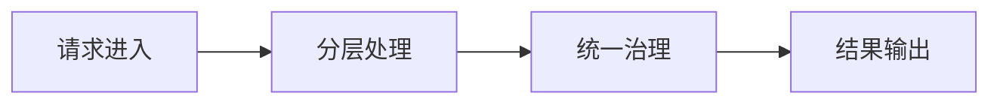

# L2-M4-S01 网关与服务治理基础

## 一句话结论

- 网关与服务治理基础 是 L2 阶段的关键能力点，面试回答建议覆盖“定义、原理、场景、边界”。

## 结构图



## 核心知识点

1. 分层边界清晰是可维护性的第一前提。
2. 统一校验、异常、日志规范能显著降低问题定位成本。
3. 优先“简单可控”实现，再逐步演进到复杂治理。

## 高频面试题

### Q1：你如何在项目中落地“网关与服务治理基础”？

答题骨架：
1. 先说明业务目标和约束。
2. 再给可执行方案和关键指标。
3. 最后补充风险、边界与回退策略。

### Q2：网关与服务治理基础 的常见误区是什么？

答题骨架：
1. 说明常见错误做法。
2. 给出正确实践和适用条件。
3. 用一个真实场景收尾。


## 前置知识

- 理解 HTTP 请求流程。
- 会写基础 Java 类。

## 术语解释（零基础友好）

- **分层**：按职责拆分控制层、业务层、数据层。
- **治理**：统一规范和监控确保可维护。

## 详细学习步骤（从不会到会）

1. 先搭最小功能链路。
2. 抽离公共校验和异常处理。
3. 验证扩展时对旧代码影响最小。

## 常见错误与纠偏

- 职责边界混乱。
- 公共逻辑重复分散。

## 学习动作

- 先手敲一次示例代码，确保可以独立运行。
- 用自己的话复述“定义 -> 原理 -> 场景 -> 边界”。
- 把本节关键结论写成 3 句速记卡，第二天复盘。

## 练习任务（建议动手）

1. 按三层实现一个查询接口。
2. 补充统一异常处理并验证返回格式。

## 练习参考方向

- 分层目标是降低维护成本与认知负担。

## 复习检查

- [ ] 能在 90 秒内说明本节核心结论
- [ ] 能独立运行并解释示例代码输出
- [ ] 能说出至少 1 个常见错误与修正方式


## 完整案例 Walkthrough（L2/L3 深挖）

### 场景输入

- 接口逻辑持续堆积在 Controller，发布后频繁出现回归问题。

### 线上现象

- 代码改动影响面扩大，缺陷定位时间变长。

### 证据采集

- 统计模块改动范围、重复代码量、异常处理分散度。

### 定位分析

- 定位为分层边界失效，公共治理（校验/异常/日志）未统一。

### 修复动作

- 重构分层职责，抽离统一校验与异常处理，补齐单元/集成测试。

### 回归验证

- 观察缺陷率、回归问题数和发布成功率是否改善。

### 实战排障清单

- Controller 保持薄层，只做入口编排。
- 公共逻辑统一沉淀，避免散落。
- 重构要配测试保障渐进落地。

## Java 示例代码（含注释，可直接运行）


**建议文件名：** `Main.java`  
**运行命令：** `javac Main.java && java Main`

**预期输出（示例）：**
```text
user-7
```

```java
class UserController {
    private final UserService userService = new UserService();

    String getUser(Long id) {
        // Controller 负责入口边界
        return userService.findNameById(id);
    }
}

class UserService {
    String findNameById(Long id) {
        // Service 负责业务逻辑
        return "user-" + id;
    }
}

public class Main {
    public static void main(String[] args) {
        UserController c = new UserController();
        System.out.println(c.getUser(7L));
    }
}
```
