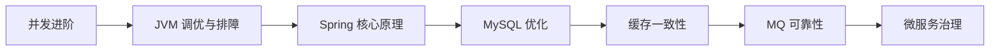

# L2 中级索引：工程与性能

## 阶段目标

- 能定位并解决常见线上性能问题。
- 能在稳定性、复杂度、成本之间做基础权衡。

## 阅读顺序

## 模块索引

| 顺序 | 模块 | 必会度 | 面试频率 | 文档状态 |
|---|---|---|---|---|
| 1 | 并发进阶（CAS/AQS/线程池） | P0 | 高 | TODO |
| 2 | JVM 调优与排障 | P0 | 高 | TODO |
| 3 | Spring 核心原理（IOC/AOP/事务） | P0 | 高 | TODO |
| 4 | MySQL 性能优化 | P0 | 高 | TODO |
| 5 | 缓存一致性治理 | P1 | 高 | TODO |
| 6 | MQ 可靠性（丢失/重复/顺序） | P1 | 中高 | TODO |
| 7 | 微服务治理基础 | P1 | 中高 | TODO |

## 推荐学习产出

- 每个模块至少 1 个“问题 -> 分析 -> 方案 -> 风险”案例。
- 每个模块至少补 1 个可口述的排障流程图。

## 关联索引

- 学习顺序总索引：[`../01-按学习顺序索引.md`](../01-按学习顺序索引.md)
- 面试频率索引：[`../02-按面试频率索引.md`](../02-按面试频率索引.md)
