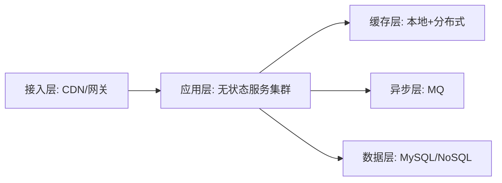

# L3-01 高并发系统设计与容量规划

## 这是什么

高级阶段核心能力：
- 对高并发场景做分层拆解
- 提前容量评估，避免被动救火
- 通过架构手段控制峰值冲击

## 架构分层图

## 核心方法

### 1) 容量评估公式（基础版）

- 峰值 QPS = 日请求量 / (24*3600) * 峰值系数
- 单机承载能力通过压测获得，不靠拍脑袋。
- 节点数 = 峰值 QPS / 单机 QPS * 安全冗余系数

### 2) 高并发常用手段

- 静态化、缓存前置、热点隔离
- 异步削峰（MQ）
- 限流与降级保护核心功能

### 3) 设计边界

- 可用性提升通常会增加复杂度和成本。
- 必须明确业务优先级，不做“全链路强一致”。

## 高频面试题

### Q1：如何设计一个秒杀系统？

答题骨架：
1. 流量预处理（静态化、验证码、限流）。
2. 库存扣减（原子性与超卖防护）。
3. 下单异步化与最终一致性。
4. 失败补偿与监控告警。

### Q2：容量评估怎么做？

答题骨架：
1. 明确峰值流量模型。
2. 压测得到单机极限。
3. 加冗余与容灾系数。
4. 给扩容与降级预案。

## 延伸阅读

- [advanced-java - 高并发架构](https://github.com/doocs/advanced-java/tree/main/docs/high-concurrency)
- [developer-roadmap - Backend](https://github.com/kamranahmedse/developer-roadmap)
