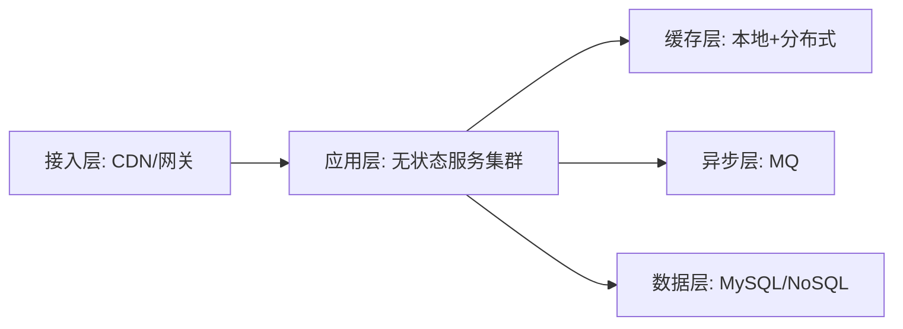

# L3-01 高并发系统设计与容量规划

## 这是什么

高级阶段核心能力：
- 对高并发场景做分层拆解
- 提前容量评估，避免被动救火
- 通过架构手段控制峰值冲击

## 架构分层图



## 核心方法

### 1) 容量评估公式（基础版）

- 峰值 QPS = 日请求量 / (24*3600) * 峰值系数
- 单机承载能力通过压测获得，不靠拍脑袋。
- 节点数 = 峰值 QPS / 单机 QPS * 安全冗余系数

### 2) 高并发常用手段

- 静态化、缓存前置、热点隔离
- 异步削峰（MQ）
- 限流与降级保护核心功能

### 3) 设计边界

- 可用性提升通常会增加复杂度和成本。
- 必须明确业务优先级，不做“全链路强一致”。

## 高频面试题

### Q1：如何设计一个秒杀系统？

答题骨架：
1. 流量预处理（静态化、验证码、限流）。
2. 库存扣减（原子性与超卖防护）。
3. 下单异步化与最终一致性。
4. 失败补偿与监控告警。

### Q2：容量评估怎么做？

答题骨架：
1. 明确峰值流量模型。
2. 压测得到单机极限。
3. 加冗余与容灾系数。
4. 给扩容与降级预案。

## 延伸阅读

- [advanced-java - 高并发架构](https://github.com/doocs/advanced-java/tree/main/docs/high-concurrency)
- [developer-roadmap - Backend](https://github.com/kamranahmedse/developer-roadmap)


## 前置知识

- 知道线程可并行执行任务。
- 会写最小可运行程序。

## 术语解释（零基础友好）

- **并发**：同一时段处理多个任务。
- **同步**：控制多线程访问顺序与一致性。

## 详细学习步骤（从不会到会）

1. 先运行最小并发示例。
2. 加入同步控制验证正确性。
3. 观察日志定位时序问题。

## 常见错误与纠偏

- 只看结果不看线程时序。
- 没有退出条件导致线程泄漏。

## 学习动作

- 先手敲一次示例代码，确保可以独立运行。
- 用自己的话复述“定义 -> 原理 -> 场景 -> 边界”。
- 把本节关键结论写成 3 句速记卡，第二天复盘。

## 练习任务（建议动手）

1. 实现主子线程协作示例。
2. 模拟竞态并给修复方案。

## 练习参考方向

- 并发问题先复现，再定位，再修复。

## 复习检查

- [ ] 能在 90 秒内说明本节核心结论
- [ ] 能独立运行并解释示例代码输出
- [ ] 能说出至少 1 个常见错误与修正方式


## 完整案例 Walkthrough（L2/L3 深挖）

### 场景输入

- 促销活动期间，接口 QPS 从 800 突增到 3,000，线程池队列持续增长。

### 线上现象

- 接口 P99 响应时间从 120ms 升到 1.8s，部分请求被拒绝。

### 证据采集

- 采集线程池指标（activeCount、queueSize、rejectCount）和热点接口调用链。

### 定位分析

- 定位到核心线程不足 + 队列过小 + 下游慢调用叠加，导致任务堆积。

### 修复动作

- 调整核心/最大线程与队列上限，隔离慢接口线程池，并给下游加超时与降级。

### 回归验证

- 压测 20 分钟观察 P99、拒绝率、CPU、队列长度恢复到安全范围。

### 实战排障清单

- 先看线程池实时指标，再看业务日志。
- 调整参数前记录基线，调整后做 A/B 对比。
- 必须验证过载时拒绝策略是否可接受。


## 错答示例 -> 修正答法 -> 打分差异（章级题解）

### 练习题目（围绕本章：高并发系统设计与容量规划）

- 请用 90 秒说明“定义 -> 原理 -> 场景 -> 风险 -> 验证”完整答题链路。
- 请补充至少 1 个线上或项目中的落地例子，并说明为什么这样做。

### 常见错答示例（低分版）

- 只说概念，不说机制：例如只背定义，无法解释底层流程。
- 只说优点，不说边界：没有说明适用条件与失败场景。
- 没有指标验证：讲完方案后不给量化结果或回归口径。

### 修正答法（高分版）

1. 先给结论：一句话说清本章知识点解决什么问题。
2. 再讲原理：用 2~3 个关键机制串起完整流程。
3. 再落场景：给出一个可复现的业务场景和方案选择理由。
4. 再说风险：列出至少 2 个常见坑和对应防护动作。
5. 最后验证：给出可观测指标（如延迟、错误率、吞吐、资源占用）与目标阈值。

### 打分差异示例（同题对比）

| 评分维度 | 错答（低分） | 修正（高分） | 提升点 |
|---|---|---|---|
| 概念准确 | 只背术语 | 术语 + 边界条件 | 避免概念混淆 |
| 原理完整 | 断点式描述 | 链路化描述 | 解释能力更强 |
| 场景匹配 | 空泛举例 | 贴近业务约束 | 方案更可信 |
| 风险意识 | 不提失败 | 提供兜底与回滚 | 工程可落地 |
| 验证闭环 | 无量化指标 | 指标 + 阈值 + 回归 | 可复盘可验收 |

### 自测动作

- 录音 90 秒复述本章答案，回听是否覆盖五段结构。
- 对照本章“复习检查”逐条打分，低于 80 分重答。
- 把本章答案压缩成 5 句话，训练高压场景下的表达稳定性。

## Java 示例代码（含注释，可直接运行）


**建议文件名：** `Main.java`  
**运行命令：** `javac Main.java && java Main`

**预期输出（示例）：**
```text
worker running
main done
```

```java
public class Main {
    public static void main(String[] args) throws InterruptedException {
        Thread worker = new Thread(() -> {
            // 子线程执行任务
            System.out.println("worker running");
        });

        worker.start();
        // join 确保主线程等待子线程结束
        worker.join();
        System.out.println("main done");
    }
}
```
