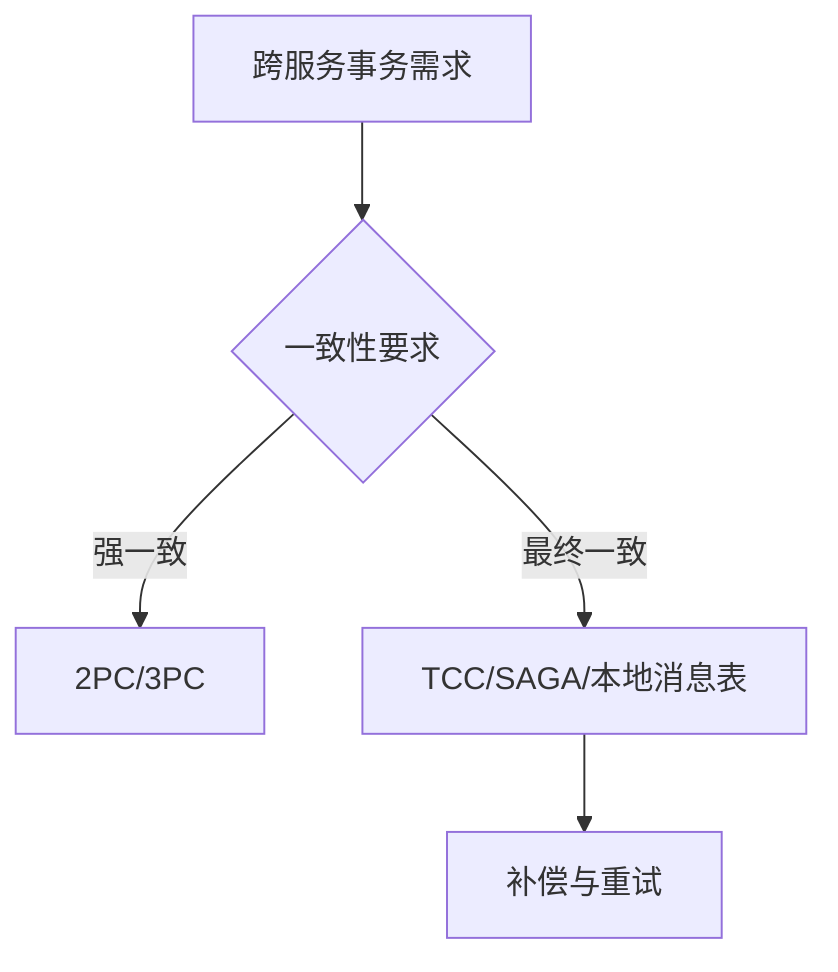

# L3-02 分布式一致性与事务方案

## 这是什么

当业务跨服务、跨库后，核心问题变成：
- 数据一致性如何保证
- 可用性和一致性如何权衡
- 失败场景如何补偿

## 方案对比图



## 核心知识点

### 1) CAP/BASE

- CAP：分区容错前提下，一致性和可用性需要权衡。
- BASE：通过最终一致性换取系统可用性与扩展性。

### 2) 常见方案

| 方案 | 优点 | 缺点 | 适用场景 |
|---|---|---|---|
| 2PC | 强一致 | 阻塞、性能开销大 | 低并发核心交易 |
| TCC | 可控性强 | 业务侵入高 | 关键资金类场景 |
| SAGA | 长事务友好 | 需要补偿设计 | 跨域业务编排 |
| 本地消息表 | 实现相对简单 | 一致性延迟 | 电商/订单常见场景 |

### 3) 设计原则

- 先定义业务一致性等级，再选技术方案。
- 任何分布式事务方案都要设计幂等与补偿。

## 高频面试题

### Q1：你们项目分布式事务怎么做？

答题骨架：
1. 业务一致性要求是什么。
2. 选择了哪种方案，为什么。
3. 如何保证幂等、补偿和监控。
4. 出现失败时怎么恢复。

### Q2：TCC 和 SAGA 怎么选？

答题骨架：
1. TCC 业务侵入高但控制力强。
2. SAGA 更适合长流程编排。
3. 根据团队复杂度承受能力做权衡。

## 延伸阅读

- [advanced-java - 分布式系统](https://github.com/doocs/advanced-java/tree/main/docs/distributed-system)
- [JavaGuide - 分布式理论](https://github.com/Snailclimb/JavaGuide/tree/main/docs/distributed-system)


## 前置知识

- 知道服务拆分后会跨库跨服务。
- 理解失败不可避免。

## 术语解释（零基础友好）

- **最终一致**：短时间可能不一致，但最终会收敛。
- **补偿**：失败后执行逆向动作恢复业务状态。

## 详细学习步骤（从不会到会）

1. 先定义一致性等级。
2. 选择方案并设计补偿。
3. 补齐幂等、重试和人工兜底。

## 常见错误与纠偏

- 追求全链路强一致导致成本过高。
- 补偿流程无监控不可追踪。

## 学习动作

- 先手敲一次示例代码，确保可以独立运行。
- 用自己的话复述“定义 -> 原理 -> 场景 -> 边界”。
- 把本节关键结论写成 3 句速记卡，第二天复盘。

## 练习任务（建议动手）

1. 比较 TCC 与 SAGA 的适用场景。
2. 设计一个本地消息表流程图。

## 练习参考方向

- 方案选择先看业务约束，再看技术偏好。

## 复习检查

- [ ] 能在 90 秒内说明本节核心结论
- [ ] 能独立运行并解释示例代码输出
- [ ] 能说出至少 1 个常见错误与修正方式


## 完整案例 Walkthrough（L2/L3 深挖）

### 场景输入

- 跨服务下单流程在支付失败时偶发库存未回滚。

### 线上现象

- 出现“订单失败但库存被占用”的最终不一致。

### 证据采集

- 回放流程日志、补偿任务记录、消息投递状态与幂等键命中。

### 定位分析

- 定位为补偿步骤触发条件不完整，且幂等键粒度过粗。

### 修复动作

- 补全状态机与补偿触发条件，细化幂等键并增加失败重放机制。

### 回归验证

- 做故障注入测试，覆盖支付超时、重复回调、消息乱序等场景。

### 实战排障清单

- 先定义一致性等级再选方案。
- 补偿流程必须可观测、可重试、可人工介入。
- 事务方案评估要包含团队维护成本。


## 错答示例 -> 修正答法 -> 打分差异（章级题解）

### 练习题目（围绕本章：分布式一致性与事务方案）

- 请用 90 秒说明“定义 -> 原理 -> 场景 -> 风险 -> 验证”完整答题链路。
- 请补充至少 1 个线上或项目中的落地例子，并说明为什么这样做。

### 常见错答示例（低分版）

- 只说概念，不说机制：例如只背定义，无法解释底层流程。
- 只说优点，不说边界：没有说明适用条件与失败场景。
- 没有指标验证：讲完方案后不给量化结果或回归口径。

### 修正答法（高分版）

1. 先给结论：一句话说清本章知识点解决什么问题。
2. 再讲原理：用 2~3 个关键机制串起完整流程。
3. 再落场景：给出一个可复现的业务场景和方案选择理由。
4. 再说风险：列出至少 2 个常见坑和对应防护动作。
5. 最后验证：给出可观测指标（如延迟、错误率、吞吐、资源占用）与目标阈值。

### 打分差异示例（同题对比）

| 评分维度 | 错答（低分） | 修正（高分） | 提升点 |
|---|---|---|---|
| 概念准确 | 只背术语 | 术语 + 边界条件 | 避免概念混淆 |
| 原理完整 | 断点式描述 | 链路化描述 | 解释能力更强 |
| 场景匹配 | 空泛举例 | 贴近业务约束 | 方案更可信 |
| 风险意识 | 不提失败 | 提供兜底与回滚 | 工程可落地 |
| 验证闭环 | 无量化指标 | 指标 + 阈值 + 回归 | 可复盘可验收 |

### 自测动作

- 录音 90 秒复述本章答案，回听是否覆盖五段结构。
- 对照本章“复习检查”逐条打分，低于 80 分重答。
- 把本章答案压缩成 5 句话，训练高压场景下的表达稳定性。

## Java 示例代码（含注释，可直接运行）


**建议文件名：** `Main.java`  
**运行命令：** `javac Main.java && java Main`

**预期输出（示例）：**
```text
compensate stock
```

```java
public class Main {
    public static void main(String[] args) {
        boolean stockReserved = true;
        boolean paySuccess = false;

        // 分布式步骤失败时执行补偿，保证最终一致
        if (stockReserved && !paySuccess) {
            System.out.println("compensate stock");
        }
    }
}
```
