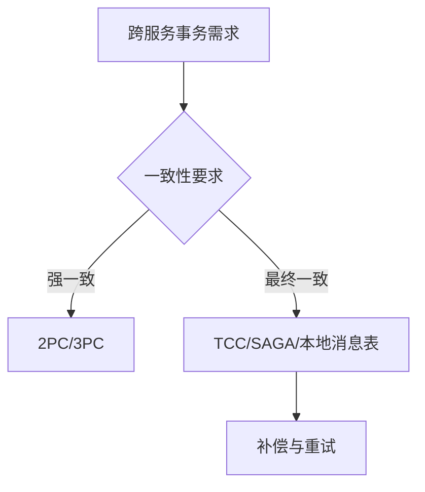

# L3-02 分布式一致性与事务方案

## 这是什么

当业务跨服务、跨库后，核心问题变成：
- 数据一致性如何保证
- 可用性和一致性如何权衡
- 失败场景如何补偿

## 方案对比图



## 核心知识点

### 1) CAP/BASE

- CAP：分区容错前提下，一致性和可用性需要权衡。
- BASE：通过最终一致性换取系统可用性与扩展性。

### 2) 常见方案

| 方案 | 优点 | 缺点 | 适用场景 |
|---|---|---|---|
| 2PC | 强一致 | 阻塞、性能开销大 | 低并发核心交易 |
| TCC | 可控性强 | 业务侵入高 | 关键资金类场景 |
| SAGA | 长事务友好 | 需要补偿设计 | 跨域业务编排 |
| 本地消息表 | 实现相对简单 | 一致性延迟 | 电商/订单常见场景 |

### 3) 设计原则

- 先定义业务一致性等级，再选技术方案。
- 任何分布式事务方案都要设计幂等与补偿。

## 高频面试题

### Q1：你们项目分布式事务怎么做？

答题骨架：
1. 业务一致性要求是什么。
2. 选择了哪种方案，为什么。
3. 如何保证幂等、补偿和监控。
4. 出现失败时怎么恢复。

### Q2：TCC 和 SAGA 怎么选？

答题骨架：
1. TCC 业务侵入高但控制力强。
2. SAGA 更适合长流程编排。
3. 根据团队复杂度承受能力做权衡。

## 延伸阅读

- [advanced-java - 分布式系统](https://github.com/doocs/advanced-java/tree/main/docs/distributed-system)
- [JavaGuide - 分布式理论](https://github.com/Snailclimb/JavaGuide/tree/main/docs/distributed-system)

## Java 示例代码（含注释，可直接运行）

**建议文件名：** `Main.java`  
**运行命令：** `javac Main.java && java Main`

**预期输出（示例）：**
```text
compensate stock
```

```java
public class Main {
    public static void main(String[] args) {
        boolean stockReserved = true;
        boolean paySuccess = false;

        // 分布式步骤失败时执行补偿，保证最终一致
        if (stockReserved && !paySuccess) {
            System.out.println("compensate stock");
        }
    }
}
```
