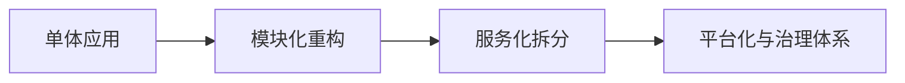

# L3-04 架构演进与技术治理面试

## 这是什么

高级面试不仅考技术点，还考“架构演进决策能力”：
- 何时拆分系统
- 如何管理技术债
- 如何推动跨团队治理

## 演进路径图



## 核心思路

### 1) 架构演进触发条件

- 团队协作效率下降
- 发布频率受限
- 性能瓶颈集中在局部模块

### 2) 技术治理抓手

- 统一编码与评审规范
- 建立性能与稳定性基线
- 统一监控、日志、链路追踪标准

### 3) 决策表达模板

高级面试建议按这套表达：
1. 业务背景
2. 约束条件
3. 方案对比
4. 最终取舍
5. 落地结果

## 高频面试题

### Q1：为什么要从单体拆成微服务？

答题骨架：
1. 先给业务增长背景。
2. 说明单体瓶颈（协作、发布、扩展）。
3. 讲拆分收益与新成本。
4. 说明治理措施（限流、可观测性、发布机制）。

### Q2：你如何推进技术治理？

答题骨架：
1. 先定义指标（故障率、发布成功率、平均恢复时长）。
2. 选择高杠杆治理项。
3. 建制度与自动化约束。
4. 用数据复盘改进。

## 对应示例

幂等治理示例：[`../../examples/l3/IdempotencyTokenDemo.java`](../../examples/l3/IdempotencyTokenDemo.java)

## 延伸阅读

- [source-code-hunter - Spring/Netty/Mybatis 源码专题](https://github.com/doocs/source-code-hunter)
- [developer-roadmap - 架构与系统设计路线](https://github.com/kamranahmedse/developer-roadmap)


## 前置知识

- 已掌握对应技术主题核心概念。
- 愿意进行口述与录音复盘。

## 术语解释（零基础友好）

- **结论先行**：第一句先回答核心问题。
- **边界条件**：方案成立的前提与限制。

## 详细学习步骤（从不会到会）

1. 先写 60 秒版本回答。
2. 补充场景和追问分支。
3. 多轮计时演练并迭代。

## 常见错误与纠偏

- 答题无结构、缺少重点。
- 不会追问时硬编细节。

## 学习动作

- 先手敲一次示例代码，确保可以独立运行。
- 用自己的话复述“定义 -> 原理 -> 场景 -> 边界”。
- 把本节关键结论写成 3 句速记卡，第二天复盘。

## 练习任务（建议动手）

1. 同一题写出 60 秒和 120 秒两个版本。
2. 为每题准备两个追问回答。

## 练习参考方向

- 回答的“结构稳定性”比堆砌知识点更重要。

## 复习检查

- [ ] 能在 90 秒内说明本节核心结论
- [ ] 能独立运行并解释示例代码输出
- [ ] 能说出至少 1 个常见错误与修正方式


## 完整案例 Walkthrough（L2/L3 深挖）

### 场景输入

- 接口逻辑持续堆积在 Controller，发布后频繁出现回归问题。

### 线上现象

- 代码改动影响面扩大，缺陷定位时间变长。

### 证据采集

- 统计模块改动范围、重复代码量、异常处理分散度。

### 定位分析

- 定位为分层边界失效，公共治理（校验/异常/日志）未统一。

### 修复动作

- 重构分层职责，抽离统一校验与异常处理，补齐单元/集成测试。

### 回归验证

- 观察缺陷率、回归问题数和发布成功率是否改善。

### 实战排障清单

- Controller 保持薄层，只做入口编排。
- 公共逻辑统一沉淀，避免散落。
- 重构要配测试保障渐进落地。

## Java 示例代码（含注释，可直接运行）


**建议文件名：** `Main.java`  
**运行命令：** `javac Main.java && java Main`

**预期输出（示例）：**
```text
结论先行，3点展开，最后补风险边界
```

```java
public class Main {
    public static void main(String[] args) {
        // 面试表达顺序：结论 -> 原理 -> 场景 -> 边界
        String answer = "结论先行，3点展开，最后补风险边界";
        System.out.println(answer);
    }
}
```
