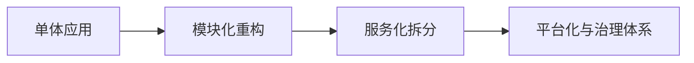

# L3-04 架构演进与技术治理面试

## 这是什么

高级面试不仅考技术点，还考“架构演进决策能力”：
- 何时拆分系统
- 如何管理技术债
- 如何推动跨团队治理

## 演进路径图



## 核心思路

### 1) 架构演进触发条件

- 团队协作效率下降
- 发布频率受限
- 性能瓶颈集中在局部模块

### 2) 技术治理抓手

- 统一编码与评审规范
- 建立性能与稳定性基线
- 统一监控、日志、链路追踪标准

### 3) 决策表达模板

高级面试建议按这套表达：
1. 业务背景
2. 约束条件
3. 方案对比
4. 最终取舍
5. 落地结果

## 高频面试题

### Q1：为什么要从单体拆成微服务？

答题骨架：
1. 先给业务增长背景。
2. 说明单体瓶颈（协作、发布、扩展）。
3. 讲拆分收益与新成本。
4. 说明治理措施（限流、可观测性、发布机制）。

### Q2：你如何推进技术治理？

答题骨架：
1. 先定义指标（故障率、发布成功率、平均恢复时长）。
2. 选择高杠杆治理项。
3. 建制度与自动化约束。
4. 用数据复盘改进。

## 对应示例

幂等治理示例：[`../../examples/l3/IdempotencyTokenDemo.java`](../../examples/l3/IdempotencyTokenDemo.java)

## 延伸阅读

- [source-code-hunter - Spring/Netty/Mybatis 源码专题](https://github.com/doocs/source-code-hunter)
- [developer-roadmap - 架构与系统设计路线](https://github.com/kamranahmedse/developer-roadmap)

## Java 示例代码（含注释，可直接运行）

**建议文件名：** `Main.java`  
**运行命令：** `javac Main.java && java Main`

**预期输出（示例）：**
```text
结论先行，3点展开，最后补风险边界
```

```java
public class Main {
    public static void main(String[] args) {
        // 面试表达顺序：结论 -> 原理 -> 场景 -> 边界
        String answer = "结论先行，3点展开，最后补风险边界";
        System.out.println(answer);
    }
}
```
