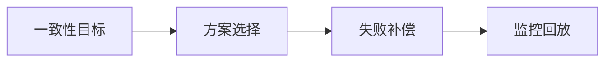

# L3-M2-S02 2PC/TCC/SAGA 对比

## 一句话结论

- 2PC/TCC/SAGA 对比 是 L3 阶段的关键能力点，面试回答建议覆盖“定义、原理、场景、边界”。

## 结构图



## 核心知识点

1. 先定义一致性等级，再选择分布式事务方案。
2. 每种方案都要设计幂等、重试、补偿和人工兜底。
3. 技术选型要和团队维护能力匹配。

## 高频面试题

### Q1：你如何在项目中落地“2PC/TCC/SAGA 对比”？

答题骨架：
1. 先说明业务目标和约束。
2. 再给可执行方案和关键指标。
3. 最后补充风险、边界与回退策略。

### Q2：2PC/TCC/SAGA 对比 的常见误区是什么？

答题骨架：
1. 说明常见错误做法。
2. 给出正确实践和适用条件。
3. 用一个真实场景收尾。

## 学习动作

- 示例代码：本节以口述与流程训练为主，可结合已有示例复习。
- 复习时至少完成 3 次 60~90 秒口述训练。
- 对照 [`../13-面试题库编号与复习规则.md`](../13-面试题库编号与复习规则.md) 补齐表达。

## 复习检查

- [ ] 能在 90 秒内说明核心结论
- [ ] 能说明至少 1 个项目场景
- [ ] 能回答 1 个追问问题

## Java 示例代码（含注释）

```java
public class SagaSnippet {
    public static void main(String[] args) {
        boolean stockReserved = true;
        boolean paySuccess = false;

        // 本地事务成功后，跨服务失败需要补偿
        if (stockReserved && !paySuccess) {
            // 补偿动作：回滚库存
            System.out.println("compensate stock");
        }
    }
}
```

