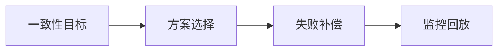

# L3-M2-S03 本地消息表实践

## 一句话结论

- 本地消息表实践 是 L3 阶段的关键能力点，面试回答建议覆盖“定义、原理、场景、边界”。

## 结构图



## 核心知识点

1. 先定义一致性等级，再选择分布式事务方案。
2. 每种方案都要设计幂等、重试、补偿和人工兜底。
3. 技术选型要和团队维护能力匹配。

## 高频面试题

### Q1：你如何在项目中落地“本地消息表实践”？

答题骨架：
1. 先说明业务目标和约束。
2. 再给可执行方案和关键指标。
3. 最后补充风险、边界与回退策略。

### Q2：本地消息表实践 的常见误区是什么？

答题骨架：
1. 说明常见错误做法。
2. 给出正确实践和适用条件。
3. 用一个真实场景收尾。


## 前置知识

- 知道异步解耦基本概念。
- 会处理简单消息消费逻辑。

## 术语解释（零基础友好）

- **幂等**：同一消息重复消费结果一致。
- **重试**：消费失败后按策略再次处理。

## 详细学习步骤（从不会到会）

1. 梳理生产、存储、消费三段可靠性。
2. 实现幂等去重。
3. 设计重试与死信兜底。

## 常见错误与纠偏

- 只关注发送成功，不关注消费确认。
- 重复消费未去重。

## 学习动作

- 先手敲一次示例代码，确保可以独立运行。
- 用自己的话复述“定义 -> 原理 -> 场景 -> 边界”。
- 把本节关键结论写成 3 句速记卡，第二天复盘。

## 练习任务（建议动手）

1. 写一个消息幂等消费示例。
2. 设计失败重试和死信处理流程。

## 练习参考方向

- 可靠性需要端到端设计，不是单点配置。

## 复习检查

- [ ] 能在 90 秒内说明本节核心结论
- [ ] 能独立运行并解释示例代码输出
- [ ] 能说出至少 1 个常见错误与修正方式

## Java 示例代码（含注释，可直接运行）


**建议文件名：** `Main.java`  
**运行命令：** `javac Main.java && java Main`

**预期输出（示例）：**
```text
handle:msg-1
skip:msg-1
```

```java
import java.util.HashSet;
import java.util.Set;

public class Main {
    private static final Set<String> processed = new HashSet<>();

    public static void main(String[] args) {
        consume("msg-1");
        consume("msg-1");
    }

    static void consume(String messageId) {
        // 幂等去重：重复消息直接跳过
        if (!processed.add(messageId)) {
            System.out.println("skip:" + messageId);
            return;
        }
        System.out.println("handle:" + messageId);
    }
}
```
