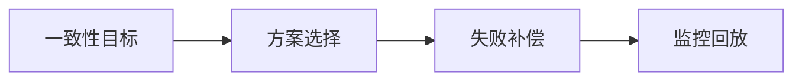

# L3-M2-S04 幂等与补偿体系

## 一句话结论

- 幂等与补偿体系 是 L3 阶段的关键能力点，面试回答建议覆盖“定义、原理、场景、边界”。

## 结构图



## 核心知识点

1. 先定义一致性等级，再选择分布式事务方案。
2. 每种方案都要设计幂等、重试、补偿和人工兜底。
3. 技术选型要和团队维护能力匹配。

## 高频面试题

### Q1：你如何在项目中落地“幂等与补偿体系”？

答题骨架：
1. 先说明业务目标和约束。
2. 再给可执行方案和关键指标。
3. 最后补充风险、边界与回退策略。

### Q2：幂等与补偿体系 的常见误区是什么？

答题骨架：
1. 说明常见错误做法。
2. 给出正确实践和适用条件。
3. 用一个真实场景收尾。


## 前置知识

- 知道服务拆分后会跨库跨服务。
- 理解失败不可避免。

## 术语解释（零基础友好）

- **最终一致**：短时间可能不一致，但最终会收敛。
- **补偿**：失败后执行逆向动作恢复业务状态。

## 详细学习步骤（从不会到会）

1. 先定义一致性等级。
2. 选择方案并设计补偿。
3. 补齐幂等、重试和人工兜底。

## 常见错误与纠偏

- 追求全链路强一致导致成本过高。
- 补偿流程无监控不可追踪。

## 学习动作

- 先手敲一次示例代码，确保可以独立运行。
- 用自己的话复述“定义 -> 原理 -> 场景 -> 边界”。
- 把本节关键结论写成 3 句速记卡，第二天复盘。

## 练习任务（建议动手）

1. 比较 TCC 与 SAGA 的适用场景。
2. 设计一个本地消息表流程图。

## 练习参考方向

- 方案选择先看业务约束，再看技术偏好。

## 复习检查

- [ ] 能在 90 秒内说明本节核心结论
- [ ] 能独立运行并解释示例代码输出
- [ ] 能说出至少 1 个常见错误与修正方式


## 完整案例 Walkthrough（L2/L3 深挖）

### 场景输入

- 跨服务下单流程在支付失败时偶发库存未回滚。

### 线上现象

- 出现“订单失败但库存被占用”的最终不一致。

### 证据采集

- 回放流程日志、补偿任务记录、消息投递状态与幂等键命中。

### 定位分析

- 定位为补偿步骤触发条件不完整，且幂等键粒度过粗。

### 修复动作

- 补全状态机与补偿触发条件，细化幂等键并增加失败重放机制。

### 回归验证

- 做故障注入测试，覆盖支付超时、重复回调、消息乱序等场景。

### 实战排障清单

- 先定义一致性等级再选方案。
- 补偿流程必须可观测、可重试、可人工介入。
- 事务方案评估要包含团队维护成本。

## Java 示例代码（含注释，可直接运行）


**建议文件名：** `Main.java`  
**运行命令：** `javac Main.java && java Main`

**预期输出（示例）：**
```text
compensate stock
```

```java
public class Main {
    public static void main(String[] args) {
        boolean stockReserved = true;
        boolean paySuccess = false;

        // 分布式步骤失败时执行补偿，保证最终一致
        if (stockReserved && !paySuccess) {
            System.out.println("compensate stock");
        }
    }
}
```
