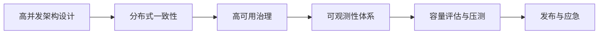

# L3 高级索引：架构与治理

## 阶段目标

- 能主导核心系统架构设计与演进。
- 能解释关键技术决策背后的取舍逻辑。

## 阅读顺序

## 模块索引

| 顺序 | 模块 | 必会度 | 面试频率 | 文档状态 |
|---|---|---|---|---|
| 1 | 高并发架构设计 | P0 | 高 | TODO |
| 2 | 分布式一致性与事务 | P0 | 高 | TODO |
| 3 | 高可用治理（限流/熔断/降级） | P0 | 高 | TODO |
| 4 | 可观测性体系（日志/指标/链路） | P1 | 中高 | TODO |
| 5 | 容量评估与压测方法 | P1 | 中高 | TODO |
| 6 | 发布策略与故障应急 | P1 | 中高 | TODO |
| 7 | 技术治理与架构演进 | P2 | 中 | TODO |

## 推荐学习产出

- 每个模块至少 1 张系统设计图。
- 每个模块至少 1 个“架构取舍”题的标准答法。

## 关联索引

- 学习顺序总索引：[`../01-按学习顺序索引.md`](../01-按学习顺序索引.md)
- 面试频率索引：[`../02-按面试频率索引.md`](../02-按面试频率索引.md)
