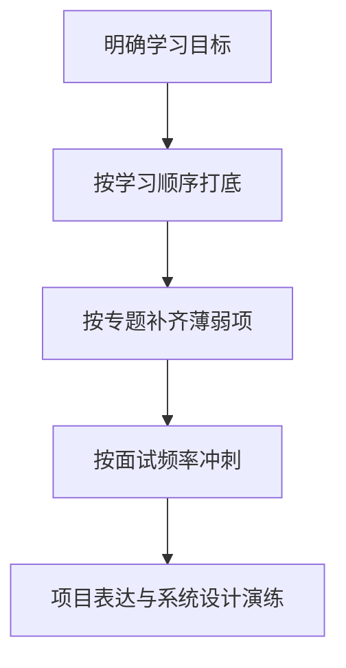

# 文档总索引

这个目录是整个知识库的导航中心。
如果你只打开一个文件，请优先看这份索引。

## 三种阅读方式

### 1) 按学习顺序（推荐首次阅读）
- 入口：[`01-按学习顺序索引.md`](./01-按学习顺序索引.md)
- 适合：系统性补基础、搭框架

### 2) 按面试频率（推荐临近面试）
- 入口：[`02-按面试频率索引.md`](./02-按面试频率索引.md)
- 适合：短时间冲刺高频题

### 3) 按知识专题（推荐查漏补缺）
- 入口：[`03-按专题索引.md`](./03-按专题索引.md)
- 适合：针对性补短板（如 JVM、MySQL、并发）

## 大纲基线（先看）

- Java 总大纲（v1）：[`10-Java后端-知识大纲-v1.md`](./10-Java后端-知识大纲-v1.md)
- GitHub 调研提炼：[`11-GitHub调研提炼-2026-03-05.md`](./11-GitHub调研提炼-2026-03-05.md)
- 六周执行计划：[`12-六周学习执行计划.md`](./12-六周学习执行计划.md)
- 题库编号规则：[`13-面试题库编号与复习规则.md`](./13-面试题库编号与复习规则.md)
- 最终汇总（完成版）：[`14-最终汇总-从基础到高级完成版.md`](./14-最终汇总-从基础到高级完成版.md)
- P0/P1 速记卡：[`15-P0-P1速记卡-可打印版.md`](./15-P0-P1速记卡-可打印版.md)
- 30 分钟模拟脚本：[`16-30分钟模拟面试脚本.md`](./16-30分钟模拟面试脚本.md)
- 个人台词模板：[`17-个人面试实战台词模板.md`](./17-个人面试实战台词模板.md)
- 详细度审计：[`18-文档详细度审计-2026-03-05.md`](./18-文档详细度审计-2026-03-05.md)

## 当前完成度

- L1 初级模块：4/4
- L1 子章节：19/19
- L2 中级模块：4/4
- L2 子章节：18/18
- L3 高级模块：4/4
- L3 子章节：16/16

## 层级导航

| 层级 | 定位 | 入口 |
|---|---|---|
| L1 初级 | 夯实基础，能清楚解释常见概念 | [`L1-初级/README.md`](./L1-初级/README.md) |
| L2 中级 | 具备工程化优化与排障能力 | [`L2-中级/README.md`](./L2-中级/README.md) |
| L3 高级 | 具备架构设计与治理能力 | [`L3-高级/README.md`](./L3-高级/README.md) |

## 路径图

## 文档规范

- 统一模板：定义、原理、场景、误区、问答、示例。
- 涉及版本差异时，必须标注 JDK / 框架版本。
- 每篇优先“短段落 + 小标题 + 列表”，避免大段文字堆积。

## 相关文档

- 学习路线：[`00-总览-学习路线.md`](./00-总览-学习路线.md)
- 规则约定：[`../AGENTS.md`](../AGENTS.md)
- 示例代码：[`../examples/README.md`](../examples/README.md)
