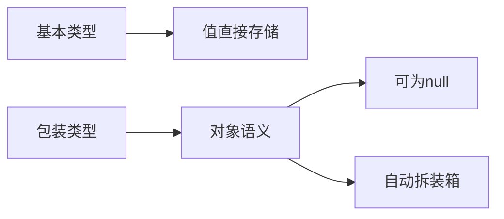

# L1-M1-S01 数据类型与包装类

## 一句话结论

- 基本类型存值，包装类型是对象；两者在性能、判空、比较语义上有明显差异。

## 知识图



## 核心知识点

### 1) 基本类型与包装类型

- 基本类型：`byte/short/int/long/float/double/char/boolean`
- 包装类型：`Byte/Short/Integer/Long/Float/Double/Character/Boolean`

常见选择：
- 计算密集、循环内热点变量优先基本类型。
- 需要 `null`、泛型、集合存储时使用包装类型。

### 2) 自动拆装箱的坑

- `Integer x = null; int y = x;` 会触发 `NullPointerException`。
- `Integer a = 127; Integer b = 127;` 可能 `a == b` 为 `true`（缓存）。
- `Integer a = 128; Integer b = 128;` 可能 `a == b` 为 `false`。

### 3) 比较规则

- 对象内容比较用 `equals`。
- 基本类型比较用 `==`。
- 包装类型比较不要依赖 `==`。

## 示例代码

- [`../../../examples/l1/DataTypeAndWrapperDemo.java`](../../../examples/l1/DataTypeAndWrapperDemo.java)

## 高频面试题

### Q1：`Integer` 和 `int` 有什么区别？

答题骨架：
1. 存储语义不同（值 vs 对象）。
2. 是否允许 `null` 不同。
3. 使用场景不同（泛型和集合必须对象）。
4. 性能与拆装箱开销需要考虑。

### Q2：为什么有时 `Integer` 用 `==` 结果“看起来正确”？

答题骨架：
1. JVM 有 Integer 缓存（常见区间 `-128~127`）。
2. 缓存命中时比较的是同一对象引用。
3. 超出缓存区间后行为不同，不能依赖。

## 复习检查

- [ ] 能解释拆装箱触发时机
- [ ] 能说出 `==` 与 `equals` 语义区别
- [ ] 能举出至少一个线上 NPE 场景


## 前置知识

- 会写基本的 `main` 方法。
- 知道变量和赋值的基本语法。
- 能区分“值”和“对象”两个概念。

## 术语解释（零基础友好）

- **自动装箱**：把基本类型自动转换为包装类型，例如 `int -> Integer`。
- **自动拆箱**：把包装类型自动转换为基本类型，例如 `Integer -> int`。
- **空指针异常**：当对象为 `null` 却被当作可用对象访问时抛出的异常。

## 详细学习步骤（从不会到会）

1. 先只使用基本类型完成一段计算，确认结果和性能表现。
2. 再改为包装类型，观察是否可以放入集合以及是否可为 `null`。
3. 刻意制造 `Integer x = null; int y = x;`，理解拆箱触发 NPE 的根因。
4. 最后总结“何时必须用包装类、何时优先基本类型”的判断规则。

## 常见错误与纠偏

- 把包装类型比较写成 `==`，导致缓存区间内外行为不一致。
- 在高频循环中滥用包装类型，增加拆装箱与 GC 压力。

## 学习动作

- 先手敲一次示例代码，确保可以独立运行。
- 用自己的话复述“定义 -> 原理 -> 场景 -> 边界”。
- 把本节关键结论写成 3 句速记卡，第二天复盘。

## 练习任务（建议动手）

1. 编写一个统计 1~1000 求和程序，对比 `int` 与 `Integer` 版本。
2. 实现一个 `safeUnbox(Integer x, int defaultValue)` 方法，避免空指针。

## 练习参考方向

- 对比时重点看：语义正确性优先，其次再看性能差异。
- `safeUnbox` 核心是判空后再返回默认值。

## 复习检查

- [ ] 能在 90 秒内说明本节核心结论
- [ ] 能独立运行并解释示例代码输出
- [ ] 能说出至少 1 个常见错误与修正方式


## 错答示例 -> 修正答法 -> 打分差异（章级题解）

### 练习题目（围绕本章：数据类型与包装类）

- 请用 90 秒说明“定义 -> 原理 -> 场景 -> 风险 -> 验证”完整答题链路。
- 请补充至少 1 个线上或项目中的落地例子，并说明为什么这样做。

### 常见错答示例（低分版）

- 只说概念，不说机制：例如只背定义，无法解释底层流程。
- 只说优点，不说边界：没有说明适用条件与失败场景。
- 没有指标验证：讲完方案后不给量化结果或回归口径。

### 修正答法（高分版）

1. 先给结论：一句话说清本章知识点解决什么问题。
2. 再讲原理：用 2~3 个关键机制串起完整流程。
3. 再落场景：给出一个可复现的业务场景和方案选择理由。
4. 再说风险：列出至少 2 个常见坑和对应防护动作。
5. 最后验证：给出可观测指标（如延迟、错误率、吞吐、资源占用）与目标阈值。

### 打分差异示例（同题对比）

| 评分维度 | 错答（低分） | 修正（高分） | 提升点 |
|---|---|---|---|
| 概念准确 | 只背术语 | 术语 + 边界条件 | 避免概念混淆 |
| 原理完整 | 断点式描述 | 链路化描述 | 解释能力更强 |
| 场景匹配 | 空泛举例 | 贴近业务约束 | 方案更可信 |
| 风险意识 | 不提失败 | 提供兜底与回滚 | 工程可落地 |
| 验证闭环 | 无量化指标 | 指标 + 阈值 + 回归 | 可复盘可验收 |

### 自测动作

- 录音 90 秒复述本章答案，回听是否覆盖五段结构。
- 对照本章“复习检查”逐条打分，低于 80 分重答。
- 把本章答案压缩成 5 句话，训练高压场景下的表达稳定性。

## Java 示例代码（含注释，可直接运行）


**建议文件名：** `Main.java`  
**运行命令：** `javac Main.java && java Main`

**预期输出（示例）：**
```text
primitive=10
wrapperEquals=true
```

```java
public class Main {
    public static void main(String[] args) {
        // 基本类型直接存值
        int primitive = 10;
        // 包装类型用于对象语义（可用于泛型/集合）
        Integer wrapper = primitive;
        System.out.println("primitive=" + primitive);
        System.out.println("wrapperEquals=" + wrapper.equals(10));
    }
}
```
