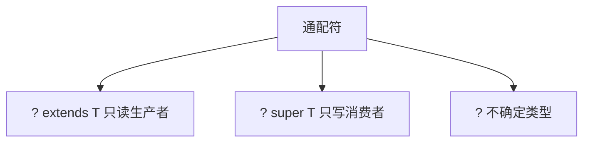

# L1-M1-S05 泛型与通配符

## 一句话结论

- 泛型解决的是“类型安全 + 代码复用”；通配符的核心是 PECS（Producer Extends, Consumer Super）。

## 规则图



## 核心知识点

### 1) 泛型价值

- 编译期类型检查，减少强制类型转换。
- 提升 API 可读性和约束能力。

### 2) PECS 原则

- 读取数据用 `? extends T`。
- 写入数据用 `? super T`。

### 3) 常见误区

- `List<Object>` 不是 `List<String>` 的父类型。
- 泛型在运行时类型擦除，不能直接 `new T()`。

## 示例代码

- [`../../../examples/l1/GenericsWildcardDemo.java`](../../../examples/l1/GenericsWildcardDemo.java)

## 高频面试题

### Q1：`? extends` 和 `? super` 有什么区别？

答题骨架：
1. `extends` 适合读取，不适合写入。
2. `super` 适合写入，读取时类型更宽。
3. 用 PECS 快速判断。

### Q2：什么是类型擦除？

答题骨架：
1. 泛型信息主要在编译期生效。
2. 运行期擦除为原始类型。
3. 解释由此带来的限制与桥接方法。

## 复习检查

- [ ] 能口述 PECS 原则
- [ ] 能解释 `List<Object>` 与 `List<String>` 关系
- [ ] 能举出类型擦除带来的限制


## 前置知识

- 会使用 `List`、`Map` 等集合。
- 知道 Java 编译器会做类型检查。
- 了解方法参数与返回值定义。

## 术语解释（零基础友好）

- **类型擦除**：泛型信息主要在编译期生效，运行时被擦除为原始类型。
- **上界通配符**：`? extends T`，主要用于读取数据。
- **下界通配符**：`? super T`，主要用于写入数据。

## 详细学习步骤（从不会到会）

1. 先写不使用泛型的集合代码，观察强转和风险。
2. 改为 `List<Integer>`，体验编译期类型保护。
3. 引入 `? extends` 与 `? super`，按 PECS 规则分别读写。
4. 总结“读多用 extends，写多用 super”的记忆法。

## 常见错误与纠偏

- 把 `List<Object>` 当成 `List<String>` 父类型，导致类型理解错误。
- 在 `? extends` 集合中尝试写入具体值，引发编译错误。

## 学习动作

- 先手敲一次示例代码，确保可以独立运行。
- 用自己的话复述“定义 -> 原理 -> 场景 -> 边界”。
- 把本节关键结论写成 3 句速记卡，第二天复盘。

## 练习任务（建议动手）

1. 实现一个泛型方法，统计 `List<? extends Number>` 的总和。
2. 实现一个方法，向 `List<? super Integer>` 批量写入整数。

## 练习参考方向

- 求和方法返回 `double` 更通用。
- 写入方法应只依赖下界约束，不要假设具体实现类型。

## 复习检查

- [ ] 能在 90 秒内说明本节核心结论
- [ ] 能独立运行并解释示例代码输出
- [ ] 能说出至少 1 个常见错误与修正方式


## 错答示例 -> 修正答法 -> 打分差异（章级题解）

### 练习题目（围绕本章：泛型与通配符）

- 请用 90 秒说明“定义 -> 原理 -> 场景 -> 风险 -> 验证”完整答题链路。
- 请补充至少 1 个线上或项目中的落地例子，并说明为什么这样做。

### 常见错答示例（低分版）

- 只说概念，不说机制：例如只背定义，无法解释底层流程。
- 只说优点，不说边界：没有说明适用条件与失败场景。
- 没有指标验证：讲完方案后不给量化结果或回归口径。

### 修正答法（高分版）

1. 先给结论：一句话说清本章知识点解决什么问题。
2. 再讲原理：用 2~3 个关键机制串起完整流程。
3. 再落场景：给出一个可复现的业务场景和方案选择理由。
4. 再说风险：列出至少 2 个常见坑和对应防护动作。
5. 最后验证：给出可观测指标（如延迟、错误率、吞吐、资源占用）与目标阈值。

### 打分差异示例（同题对比）

| 评分维度 | 错答（低分） | 修正（高分） | 提升点 |
|---|---|---|---|
| 概念准确 | 只背术语 | 术语 + 边界条件 | 避免概念混淆 |
| 原理完整 | 断点式描述 | 链路化描述 | 解释能力更强 |
| 场景匹配 | 空泛举例 | 贴近业务约束 | 方案更可信 |
| 风险意识 | 不提失败 | 提供兜底与回滚 | 工程可落地 |
| 验证闭环 | 无量化指标 | 指标 + 阈值 + 回归 | 可复盘可验收 |

### 自测动作

- 录音 90 秒复述本章答案，回听是否覆盖五段结构。
- 对照本章“复习检查”逐条打分，低于 80 分重答。
- 把本章答案压缩成 5 句话，训练高压场景下的表达稳定性。

## Java 示例代码（含注释，可直接运行）


**建议文件名：** `Main.java`  
**运行命令：** `javac Main.java && java Main`

**预期输出（示例）：**
```text
n=1
n=2
n=3
target=[10]
```

```java
import java.util.ArrayList;
import java.util.Arrays;
import java.util.List;

public class Main {
    public static void main(String[] args) {
        List<Integer> source = Arrays.asList(1, 2, 3);
        List<Number> target = new ArrayList<>();

        printAll(source);      // extends: 读取
        addInt(target);        // super: 写入
        System.out.println("target=" + target);
    }

    static void printAll(List<? extends Number> list) {
        for (Number n : list) {
            System.out.println("n=" + n);
        }
    }

    static void addInt(List<? super Integer> list) {
        list.add(10);
    }
}
```
